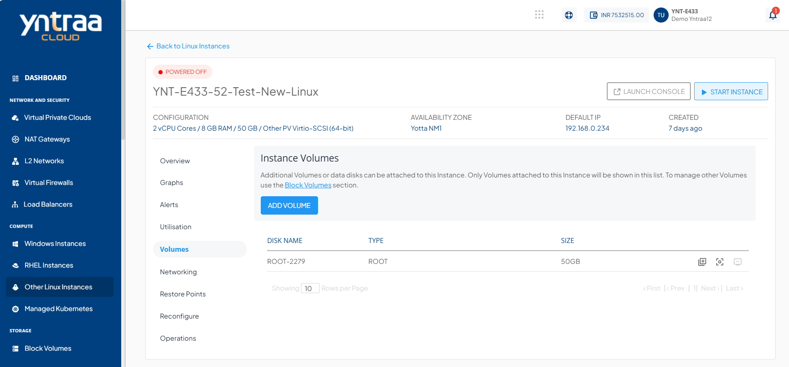

# Volume Management 

To view the disks attached to this Instance:
1. Navigate to [Other Linux Instances](AboutLinuxInstances.md).
2. Select a Linux Instance and select the **Volumes** tab. The following screen appears:
   
3. Access the **Volumes** tab to manage disks associated with the instance using the [Block Volumes](/docs/Subscribers/Storage/BlockVolumes/AboutBlockVolumes) service.
4. The following are the quick actions:
- **Create Template** - Click on it, and enter the image name and description.
- **Create Restore Point** - Click on it, to create a Volume Restore Point.
- **Detach/attach from Instance** - This option attach/detach the volume to/from the instance.

:::note
Volume-level operations are available as part of the Block Volumes service.
:::

