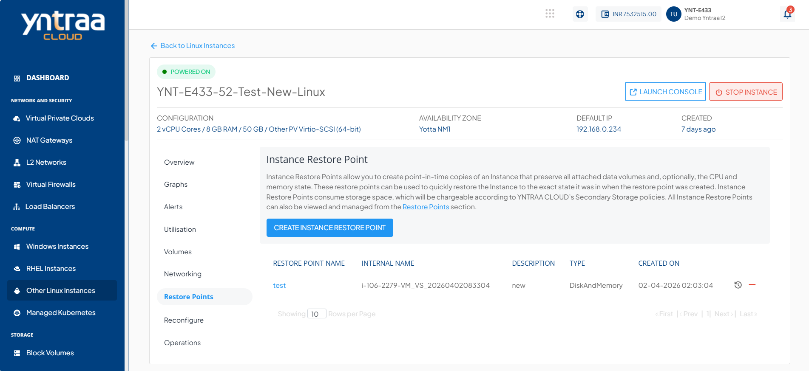
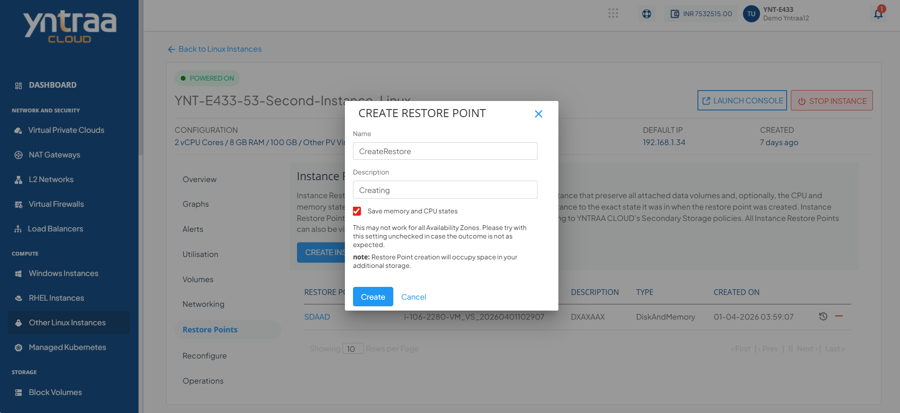

# Working with Linux Instance Restore Point

 To view all the Restore Points taken for Instance, navigate to [Operating Linux Instances](AboutLinuxInstances.md), select a Linux Instance and access the **Restore Points** tab.

Instance Restore Points allow you to create point-in-time images of instances that preserve all their data volume as well as (optionally) their CPU/memory states. You can use Restore Points to quickly restore Instances.

The Restore Points section shows all the Linux Instance Restore Points, which can be used to revert the Linux Instances to an earlier state.

A Restore Point lists the following details:

- Restore Point Name
- Description
- Internal Name
- Type
- Created On

The following quick options are available:
- **Revert the Instance from the Restore Point**
- **Delete the Restore Point**
  
## Creating a Restore Point
To create a Snapshot, the following steps are :
1. Click the **CREATE INSTANCE RESTORE POINT** button. The following screen appears.
   
2. Enter the **Name** and **Description** of the restore point.
3. Click the **Create** button. 

