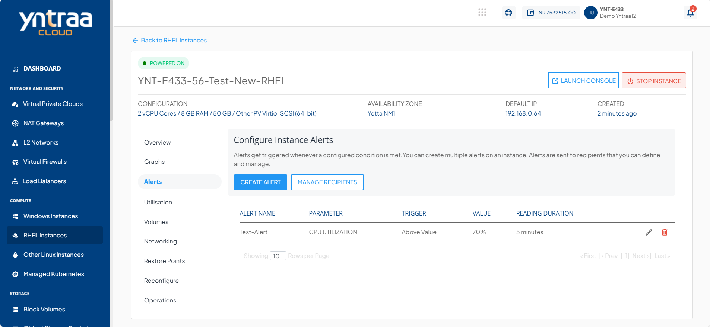
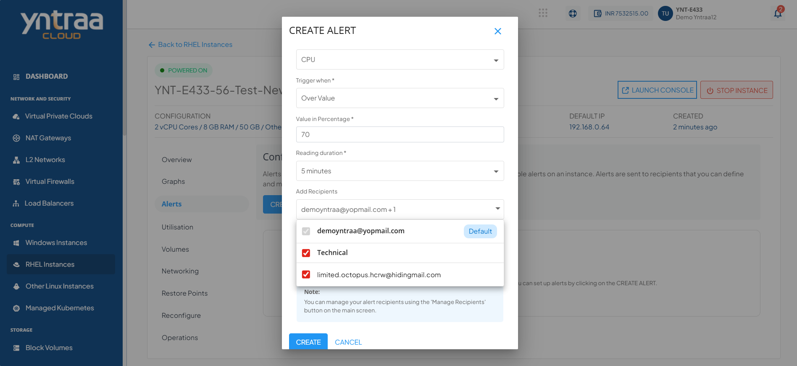
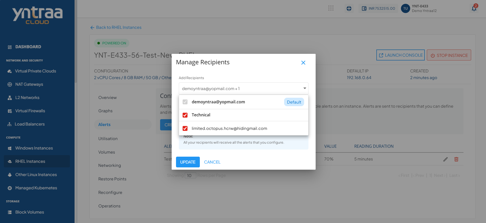

# Configuring Alerts 

Alerts get triggered whenever a configured condition is met. You can create multiple alerts on an instance. Alerts are sent to recipients that you can define and manage.

You can configure alerts for instances running on the Yntraa Cloud. You can define alerts for Instances and configure the email recipients for these alerts using a straightforward and easy-to-use interface.

To view the configured alerts or configure new ones, navigate to [RHEL Instance](AboutRHELInstances.md) and access the **Alerts** tab.
## Instance Alerts

The Alerts tab lists all the alerts already configured for that particular RHEL Instance. In addition, it will show the details:
- Alert Name
- Parameter
- Trigger
- Value
- Reading Duration
  

## Creating an Alert

You can create or add alerts simply by clicking the **CREATE ALERT** button. The following screen appears, and you can configure the alert using the on-screen input form.

The various fields of the add alert page are described below:

1. **Name** - You can define the name for your alert.
2. **Choose Parameter** - This option will allow you to define what parameter must be monitored to trigger the alert email. Yntraa cloud supports CPU, RAM, Disk, 1-min Load Average, 5- min Load Average, 15- min Load Average parameters.
3. **Trigger when** - This set of options lets you define whether to trigger above or below a custom value.
4. **Reading duration** - This option lets you define the breach window, i.e., the duration for which the breach has to be consistent to trigger the alert email.
5. **Add Recipients** - Email IDs (comma-separated) can be added here, or also you can add them by using the configure recipients.

## Managing Recipients

This section list and display all the email IDs already configured for the alerts. You can delete the existing email IDs and add other email IDs by the following steps :

1. Click on the **Manage Recipients** button.
2. Click on **+ Add More Recipients**.
3. Add the email IDs; You can add multiple IDs separated by comma.
4. Click on the **+** icon.
5. Click on the **UPDATE** button, and update the recipient's list.
   

   
:::note
All the recipients configured will receive all the setup alerts. If no email ID is configured or added, then no email will be sent for the already configured alerts.
:::

