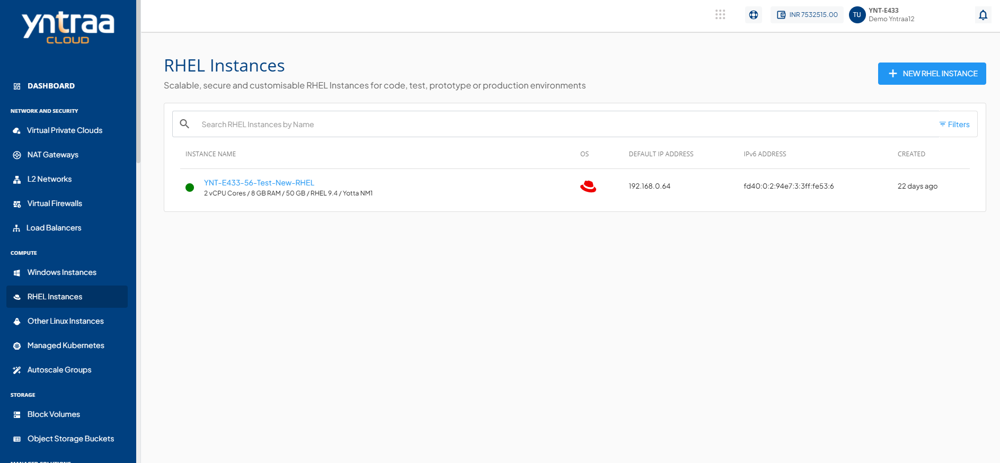

# Creating Alerts 

Alerts get triggered whenever a configured condition is met. You can create multiple alerts on an instance. Alerts are sent to recipients that you can define and manage.

You can configure alerts for instances running on the Yntraa Cloud. You can define alerts for Instances and configure the email recipients for these alerts using a straightforward and easy-to-use interface.

To create an alert, navigate to [RHEL Instance](AboutRHELInstances.md) and access the **Alerts** tab. 
## Instance Alerts

The Alerts tab lists all the alerts already configured for that particular RHEL Instance. In addition, it shows the following details:

- Alert Name
- Parameter
- Trigger
- Value
- Reading Duration

## Creating an Alert

To create an alert, follow these steps:
1. Navigate to **Compute > RHEL Instances**. The following screen appears:  
2. Click **Instance Name**. The following screen appears:  
3. Click the **Alerts** tab. The following screen appears: 
4. Click the **Create Alert** button. The following screen appears: 
5. Provide the following details in their respective fields:
	- **Name** - You can define the name for your alert.
	- **Choose Parameter** - This option allows you to define what parameter must be monitored to trigger the alert email. Yntraa Cloud supports CPU, RAM, NETWORK INPUT, NETWORK OUTPUT parameters.
	- **Trigger when** - This set of options lets you define whether to trigger above or below a custom value.
	- **Value in Percentage** - You can define the trigger value/threshold.
	- **Reading duration** - This option lets you define the breach window, i.e., the duration for which the breach has to be consistent to trigger the alert email.
	- **Add Recipients** - Email IDs can be added here, or also you can add them by using the manage recipients.  
  6. Click **Create** button.

## Managing Recipients

This section list and display all the email IDs already configured for the alerts. You can delete the existing email IDs and add other email IDs by the following steps:

1. Click the **Manage Recipients** button. The following screen appears:
   
2. Use the dropdown menu to select available recipients.
3. Click the **Update** button to save the recipient list.
   
:::note
All the managed recipients receive all the setup alerts. If no email ID is configured or added, no email is sent for the already configured alerts.
:::

