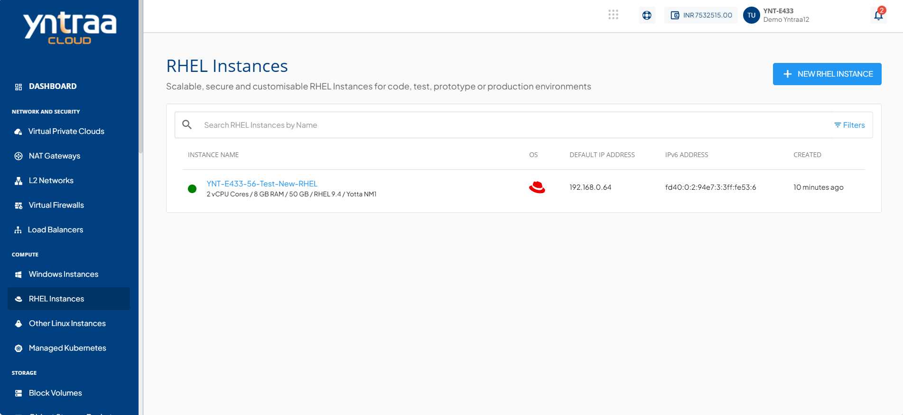
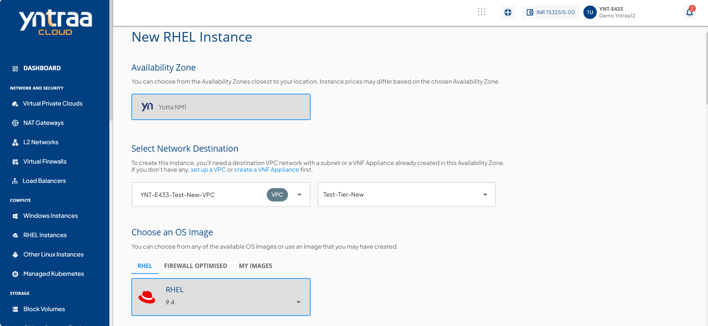
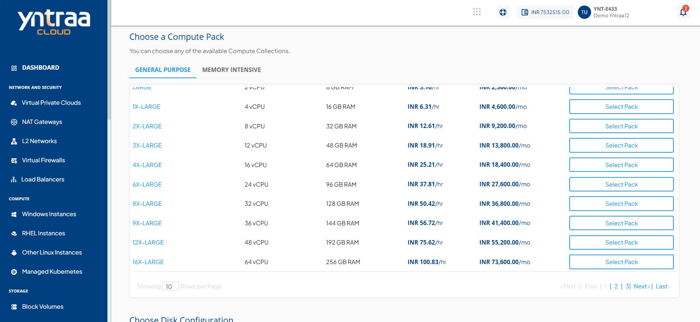
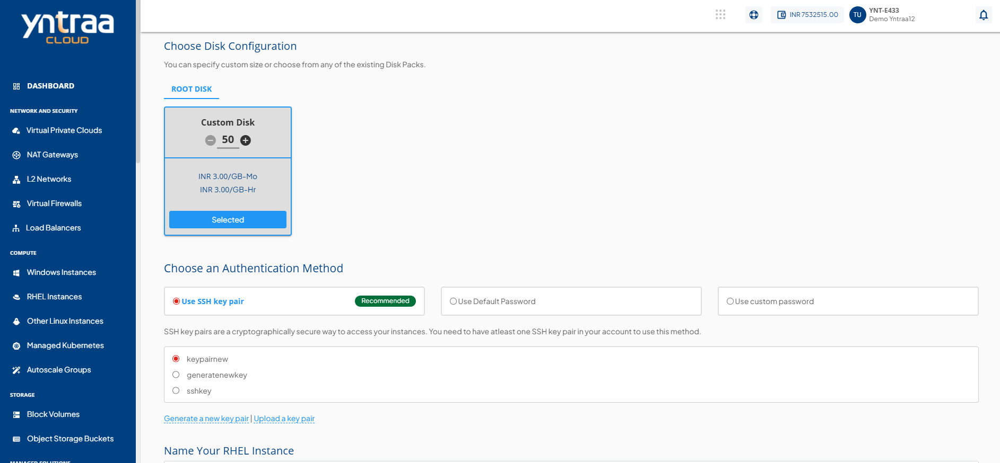
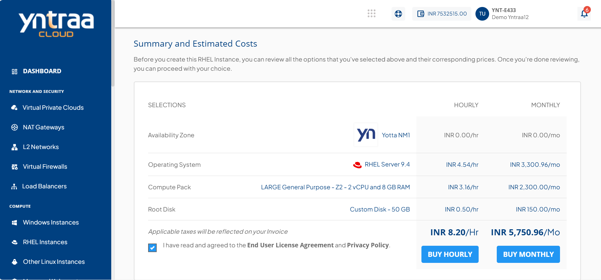
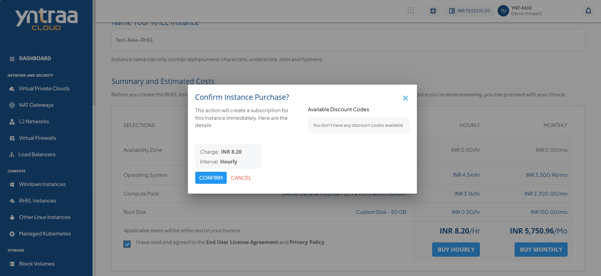

# Creating RHEL Instances
Before creating a RHEL instance, it is important to plan the architecture, networking and access to the RHEL Instances. 

To create a RHEL instance, follow these steps:

1. Navigate to **Compute > RHEL Instances**.

2. Click the **+ New RHEL Instance** button. The following screen appears: 
    
3. Choose an **Availability Zone**, which is the geographical region where your Instance deploys.
4. Select a VPC or VNF network from the **Select Network Destination** drop-down, and select the appropriate tier listed in network.
5. Select the OS image to run on your Instance.
6. Navigate to **Choose an OS Image > My Images**, and select an image.
7. Select the compute pack from the available compute collections.

8. Select a root disk for your instance from the available options or choose **Custom Disk** to define the size. Adjust the disk size as required and click **Select Pack** to confirm.

9. **Choose an Authentication Method**: 
    - **Use SSH key pair**: To view all the SSH key pairs present in your account, click the **Use SSH key pair** option. If your account doesn’t have any SSH key pair, then you can click the **Generate a new key pair** or upload the key pair by clicking the **Upload a key pair** option. 
    - **Use Default Password**: On selecting **Use Default Password**, the system automatically generates a password for the instance. You can view or copy this password from the instance details page after creation and use it to log in.
    - **Use Custom Password**: On selecting **Use Custom Password**, you are required to enter and confirm your own password. This password is used to access the instance after it is created. Ensure the password meets the required security criteria.
10. In the **Name Your RHEL Instance** field, enter the desired name for your RHEL instance.
11. Verify the Estimated Cost of your Windows Instance based on the chosen specifications from the Summary and Estimated Costs Section (Here, both Hourly and Monthly Prices summary are displayed).
12.  Select the **I have read and agreed to the End User License Agreement and Privacy Policy** option.
13. Choose the **Buy Hourly** or **Buy Monthly** option. A confirmation window appears and the price summary displays along with the discount codes if you have any in your account. 
    - You can apply any of the discount codes listed by clicking on the **Apply** button. 
    - You can also remove the applied discount code by clicking on the **Remove** button. 
    - You can cancel this action by clicking on the **Cancel** button.
    
14. Click the **Confirm** button to create the RHEL Instance.
    

:::note
It might take up to 5-8 minutes for the instance to create. You may use the cloud console during this time, but it is advised that you do not refresh the browser window.
:::

Once ready, you get notified of this purchase on your registered email address. To access the newly created RHEL Instances, navigate to **Compute > RHEL Instances**.

