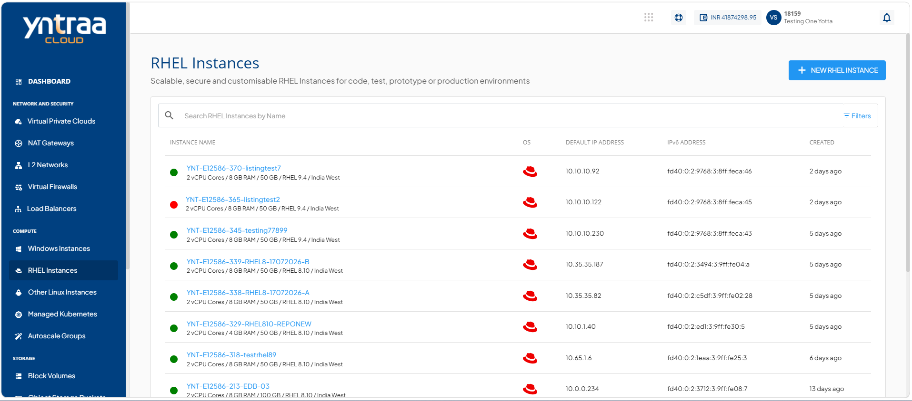
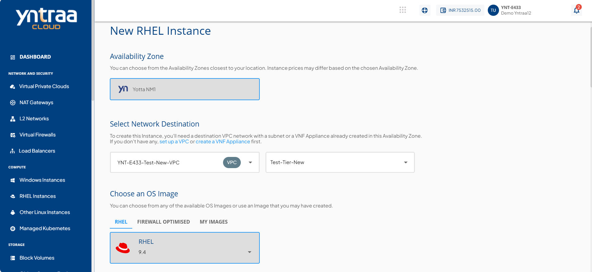
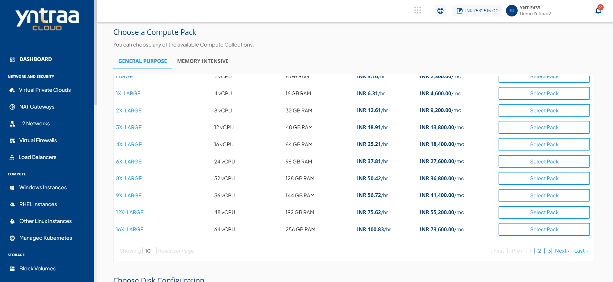
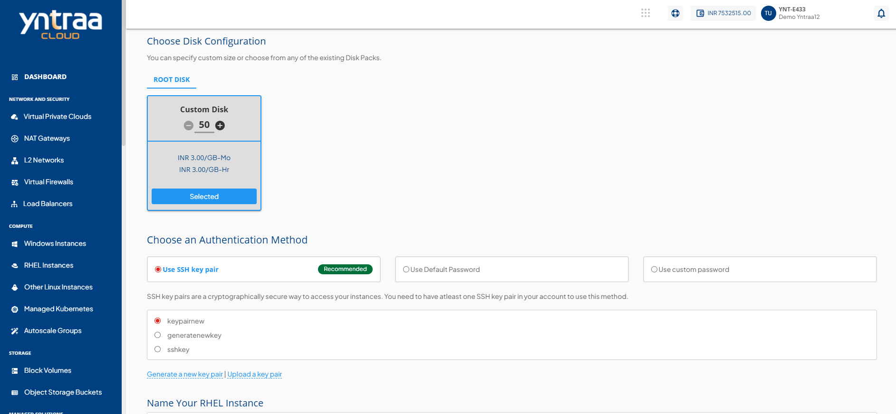
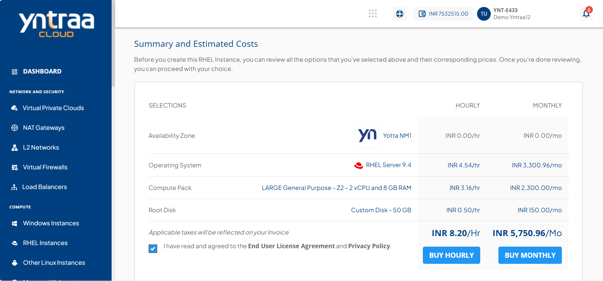
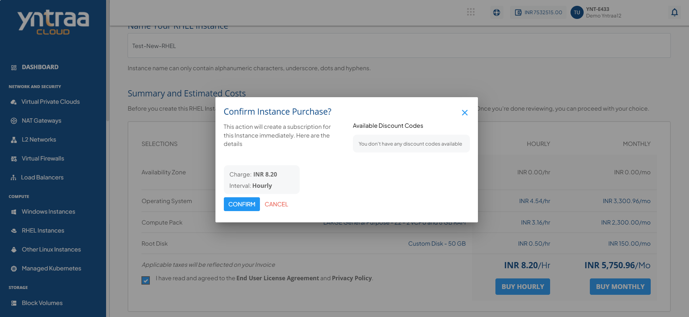

# Creating RHEL Instances

Create a RHEL instance to deploy a virtual machine for running RHEL-based applications and workloads in the cloud. During creation, you configure the required compute, storage, networking, and other settings to provision an instance that meets your workload requirements.

To create a RHEL instance, follow these steps:

1. Navigate to **Compute > RHEL Instances**.
   
2. Click the **+ New RHEL Instance** button. The following screen appears: 
    
   
   
   
3. Choose an Availability Zone, which is the geographical region where your Instance deploys.
4. Select a VPC or VNF network from the **Select Network Destination** drop-down, and select the appropriate tier listed in network.
5. Select an OS Image for your instance, or choose a customized image from **My Images**.
6. Select a compute pack from the list.
7. Select a **Root Disk** for your instance from the available options or choose **Custom Disk** to define the size. Adjust the disk size as required.
8. **Choose an Authentication Method**: 
    - **Use SSH key pair**: To view all the SSH key pairs present in your account, click the **Use SSH key pair** option. If your account doesn’t have any SSH key pair, then you can click the **Generate a new key pair** option or upload the key pair by clicking the **Upload a key pair** option. 
    - **Use Default Password**: On selecting **Use Default Password**, the system automatically generates a password for the instance. You can view or copy this password from the instance details page after creation and use it to log in.
    - **Use Custom Password**: On selecting **Use Custom Password**, you are required to enter and confirm your own password. This password is used to access the instance after it is created. Ensure the password meets the required security criteria.
9. In the **Name Your RHEL Instance** field, enter the desired name for your RHEL instance.
10. Verify the Estimated Cost of your RHEL Instance based on the chosen specifications from the Summary and Estimated Costs Section.
11. Select the **I have read and agreed to the End User License Agreement and Privacy Policy** option, and then click **Buy Hourly** or **Buy Monthly** button. The following screen appears.
     
12. Click the **Confirm** button. The RHEL Instance is created.

