# Managing RHEL Instance Operations

You can manage the lifecycle of RHEL instance by restarting, force stopping, renaming, or deleting. These operations help you maintain service availability, resolve operational issues, organize resources, and manage your cloud infrastructure efficiently.

Yntraa Cloud provides the following operations on RHEL instances:

  
- [Restarting an Instance](#restarting-an-instance)
- [Force Stopping an Instance](#force-stopping-an-instance)
- [Renaming an Instance](#renaming-an-instance)
- [Deleting an Instance](#deleting-an-instance)

## Restarting an Instance

Restart a RHEL instance to refresh its operating state, apply certain configuration changes, or resolve temporary issues without changing its existing settings. This action helps restore normal operation, improve service reliability, and ensure efficient traffic distribution across backend resources.

To restart a RHEL instance, follow these steps: 

1. Navigate to **Compute > RHEL Instances**. The following screen appears:
   
2. Click on your created RHEL instance name from the list. The Overview tab opens automatically. The following screen appears: 
   
3. Click the **Restart Instance** button. The following screen appears: 
   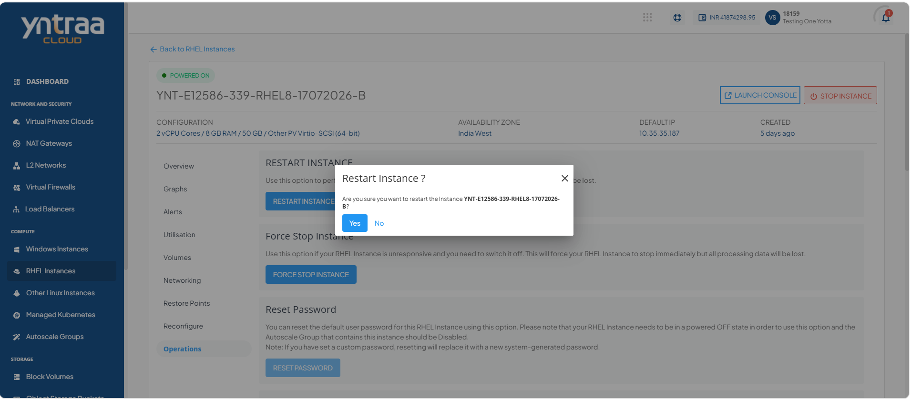
4. Click the **Yes** button.
   
## Force Stopping an Instance

Force stop a RHEL instance to immediately terminate its operations when it becomes unresponsive or cannot be shut down through a normal stop operation. This action helps recover from critical issues, restore control of the instance, and prepare it for troubleshooting or restart. 

To force stop a RHEL instance, follow these steps: 

1. Navigate to **Compute > RHEL Instances**. The following screen appears:
   
2. Click on your created RHEL instance name from the list. The Overview tab opens automatically. The following screen appears: 
   
3. Click the **Force Stop Instance** button. The following screen appears: 
   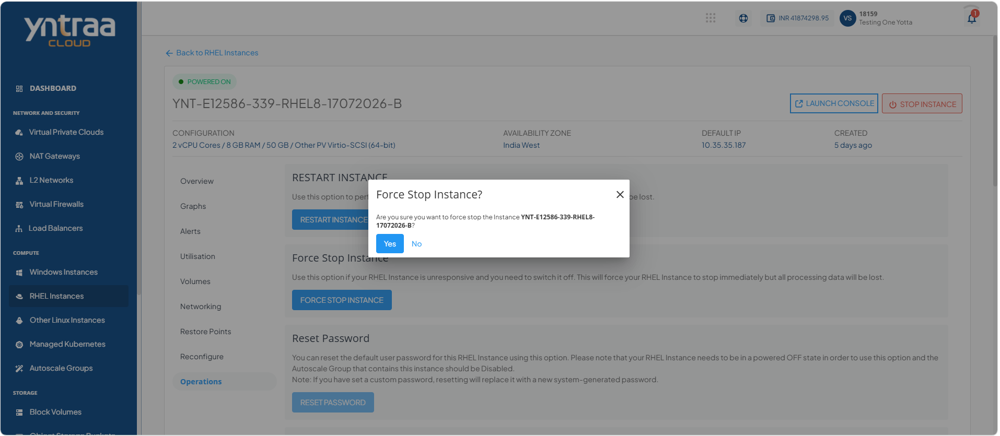
 4. Click the **Yes** button. 
    
## Resetting Password of an Instance

Resetting the password allows you to regain access to your RHEL instance if you have forgotten the current password or need to update it for security purposes. You can generate a new administrator password and use it to securely sign in to your RHEL instance.

To reset password of a RHEL instance, follow these steps: 

1. Navigate to **Compute > RHEL Instances**. The following screen appears:
   
2. Click on your created RHEL instance name from the list. The Overview tab opens automatically. The following screen appears: 
   
3. Click the **Stop Instance** button. The following screen appears: 
   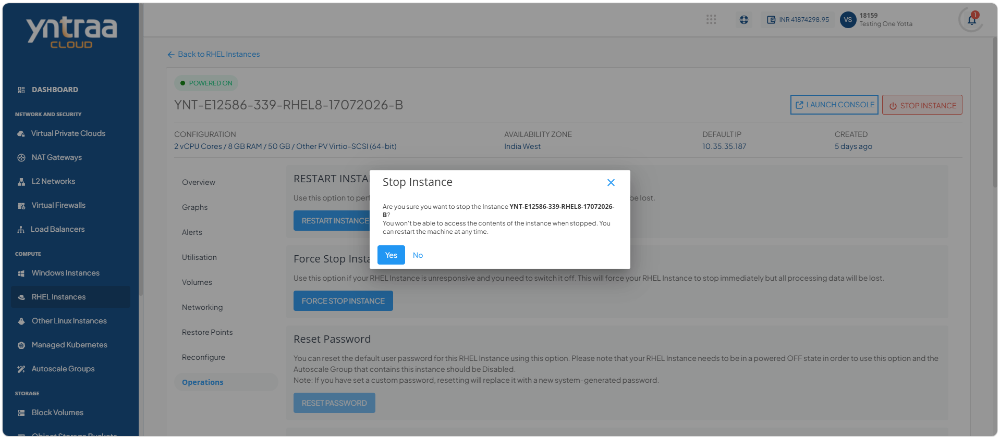
4. Click the **Yes** button. The following screen appears: 
   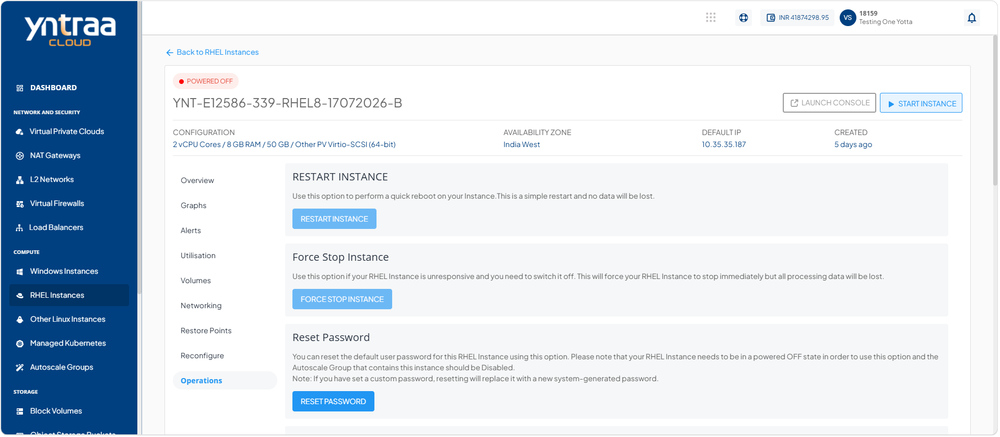
5. Click the **Reset Password**. The following screen appears: 
   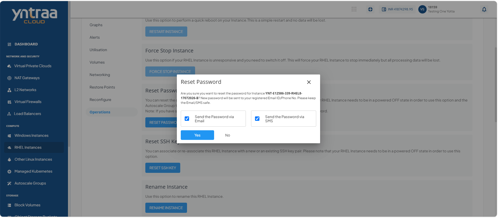
6. Select the **Send the Password via Email** or **Send the Password via SMS** option, and click the **Yes** button.
A password reset link is sent to your registered email address or mobile number.

## Resetting SSH key

Resetting the SSH key allows you to replace the existing key pair associated with your RHEL instance. This is useful if the current SSH key is lost, compromised, or needs to be updated for secure administrative access.

To reset SSH key of a RHEL instance, follow these steps: 

1. Navigate to **Compute > RHEL Instances**. The following screen appears:
   
2. Click on your created RHEL instance name from the list. The Overview tab opens automatically. The following screen appears: 
   
3. Click the **Stop Instance** button. The following screen appears: 
   
4. Click the **Yes** button. The following screen appears: 
   
5. Click the **Reset SSH key** button. The following screen appears: 
   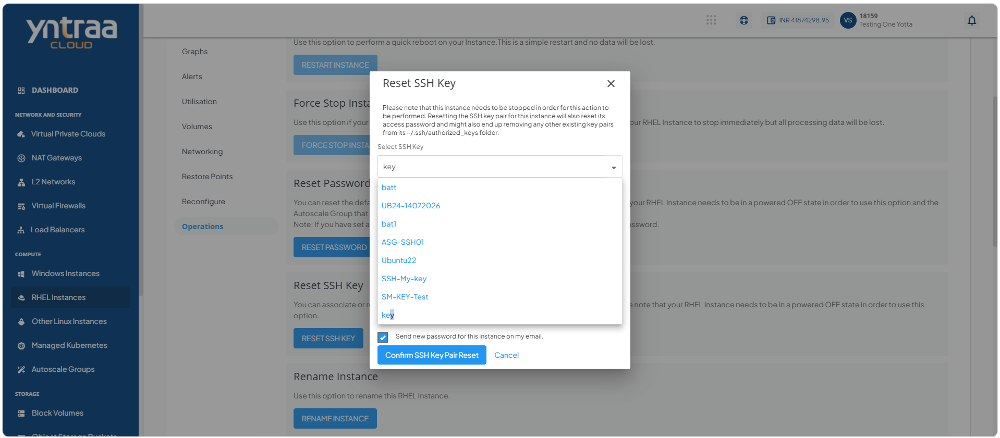
6. Select an SSH key from the dropdown and select the **Send New Password for this Instance on my Email** option, and then click **Confirm SSH Key Pair Reset** button. 
A password reset link is sent to your registered email address.

## Migrating Network

Migrating a RHEL instance between networks allows you to move the instance from its current network to a different target network while retaining the instance and its data. This is useful when reorganizing network infrastructure, improving connectivity, or aligning the instance with a different network environment.
:::note
Remove any **Port Forwarding**, **Load Balancing**, or **Static NAT** configurations from the selected NIC before migrating the instance to another network.
::: 

To migrate RHEL Instance between networks, follow these steps:

1. Navigate to **Compute > RHEL Instances**. The following screen appears:
   
2. Click on your created RHEL instance name from the list. The Overview tab opens automatically. The following screen appears: 
   
3. Click the **Migrate Network** button. The following screen appears: 
   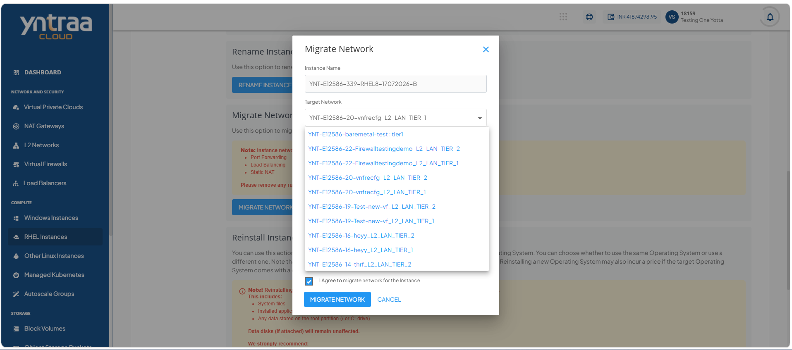
4. Select the target network from the dropdown, and select the **I Agree to Migrate Network for the Instance** option, and click the **Migrate Network** button. 
   
## Reinstalling Window Instance

Reinstalling a RHEL instance replaces the existing operating system with a fresh installation while preserving the instance configuration. This is useful for recovering from system issues, restoring a clean operating system, or resolving configuration problems.

:::note
Reinstalling the operating system permanently erases all data on the root disk, including system files, installed applications, and any data stored on the root partition (/ or C drive). Attached data disks remain unaffected. Before proceeding, create a restore point or backup of the instance and ensure that you have saved all important data to another location.
:::

To reinstalling a RHEL instance, follow these steps:

1. Navigate to **Compute > RHEL Instances**. The following screen appears:
   
2. Click on your created RHEL instance name from the list. The Overview tab opens automatically. The following screen appears: 
   
3. Click the **Reinstall Instance** button. The following screen appears: 
   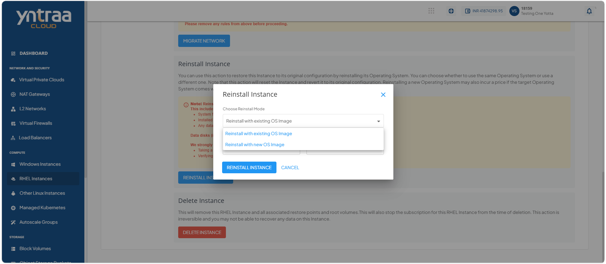
4. Select a Reinstall Mode from the dropdown and select the **Send the Password via Email** or **Send the Password via SMS** option, and then click **Reinstall Instance**. The following screen appears: 
   
## Renaming an Instance

Rename a RHEL instance to assign a more meaningful or recognizable name without affecting its configuration or functionality. This action helps improve resource identification, simplifies instance management, and makes it easier to locate the instance in cloud environment. 

To rename an instance, follow these steps: 

1. Navigate to **Compute > RHEL Instances**. The following screen appears:
   
2. Click on your created RHEL instance name from the list. The Overview tab opens automatically. The following screen appears: 
   
3. Click the **Rename Instance** button. The following screen appears where you can update the RHEL instance name in Instance Name.
   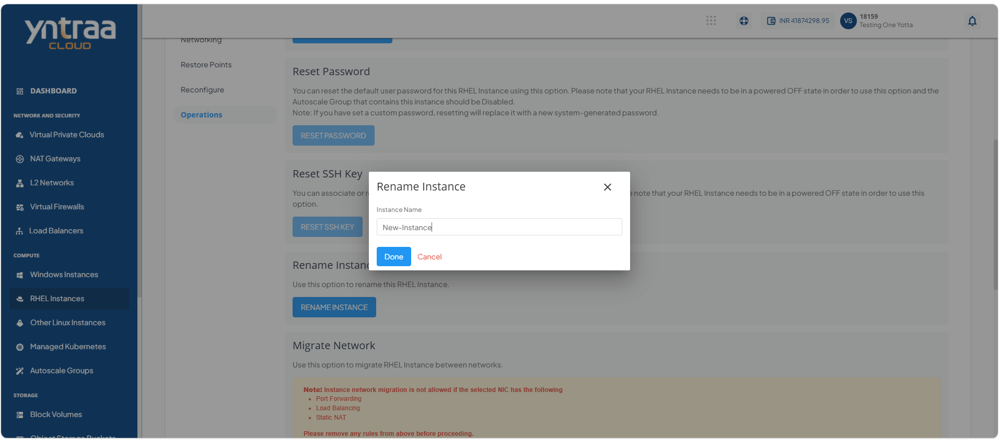
4. Click the **Done** button. The new instance name appears (highlighted in red). 
   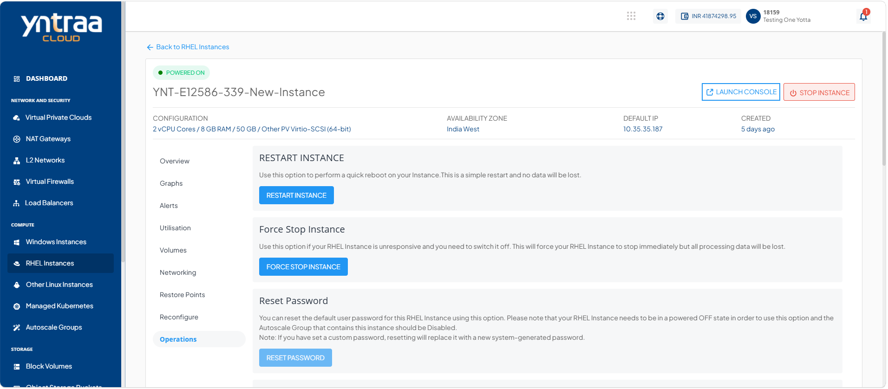

## Deleting an Instance

Delete a RHEL instance when it is no longer required to remove it permanently from cloud environment. This action helps free up resources, reduce unnecessary costs, and keep your infrastructure organized by eliminating unused instances. 
:::warning
You can schedule deletion to continue using the resource until the end of the current billing cycle and cancel the deletion before it takes effect. Alternatively, you can delete the resource immediately, which is permanent and cannot be undone.
:::

To delete an instance, follow these steps:

1. Navigate to **Compute > RHEL Instances**. The following screen appears:
   
2. Click on your created RHEL instance name from the list. The Overview tab opens automatically. The following screen appears: 
   
3. Click the **Delete Instance** button. The following screen appears: 
   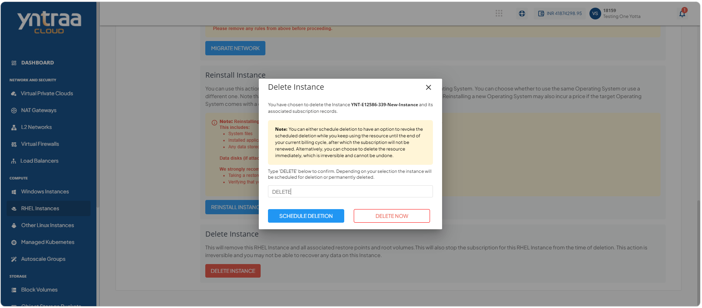
4. Enter **DELETE** and click the **Delete Now** button. The RHEL instance is deleted.
5. Enter **DELETE** and click the **Schedule Deletion** button.

