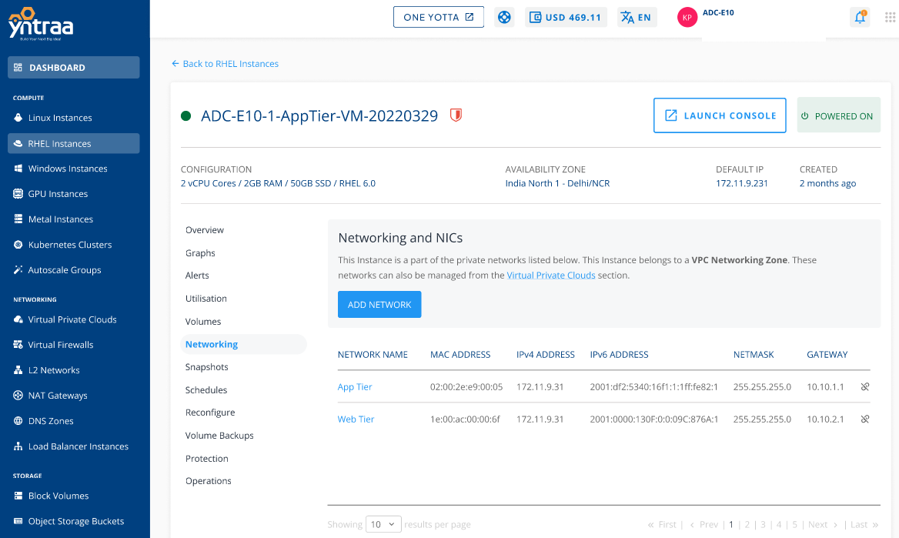

# Networking Management

 To view the networks of a particular Instance is attached to, navigate to  [RHEL Instances](AboutRHELInstances.md), and access the **Networking** tab.
 

The following actions are available:

- If the Instance is inside a VPC, you can associate the Instance to multiple tiers within the VPC or share the Instance with other VPC networks in the same Availability Zone by using the **ADD NETWORK** option.
- Network/tier associations can be removed from this section by using the **Unlink** action.

:::note
Advanced networking configurations can be done using the Virtual Private Cloud service.
:::

