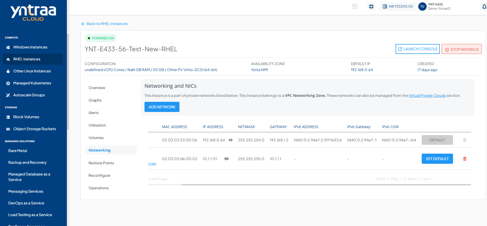
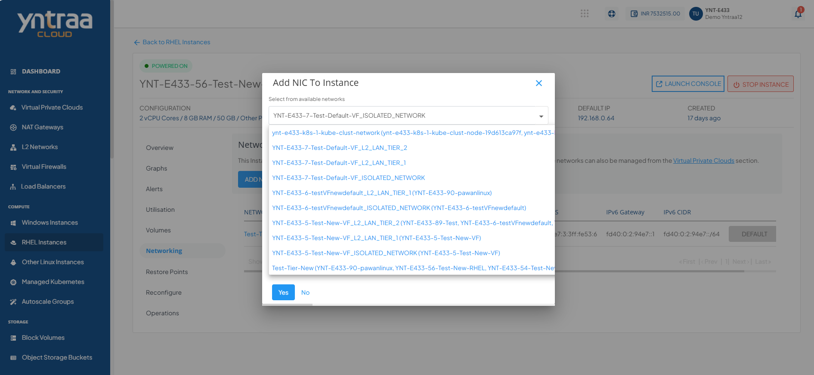
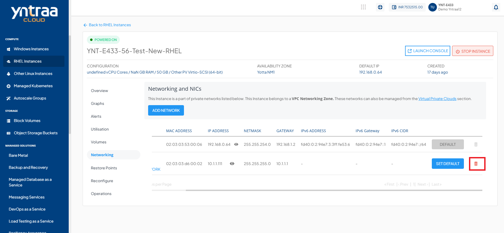

# Networking Management

To add the networks to the RHEL instances, follow these steps:
1. Navigate to **Compute** > [RHEL Instances](AboutRHELInstances.md).
2. Click **Instance Name**, and select the **Networking** tab. The following screen appears:

3. Click the **Add Network** button. The following screen appears:

4. Select the available network from the dropdown.
5. Click **Yes** to attach the NIC to the instance.

:::note
If the Instance is inside a VPC, you can associate the Instance to multiple tiers within the VPC or share the Instance with other VPC networks in the same Availability Zone by using the **Add Network**.
:::

## Deleting NIC 

To delete the network tier, click the **Delete NIC** icon. 

:::note
Advanced networking configurations can be done using the Virtual Private Cloud service.
:::

