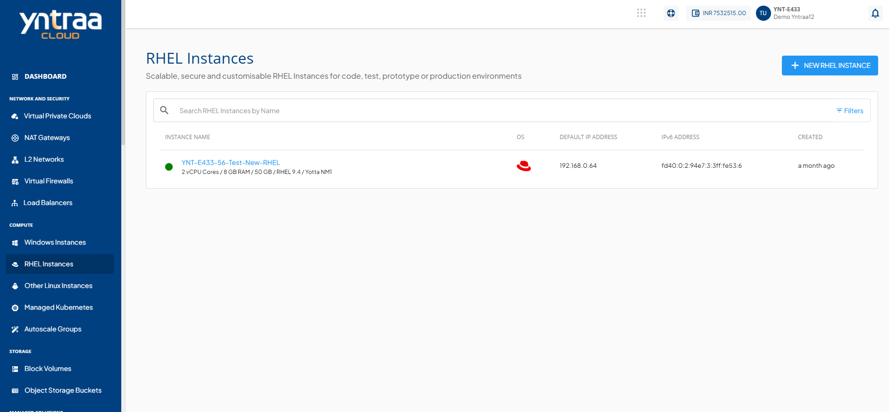

# RHEL Instance Operations

To view all available Instance operations:
1. Navigate to **Compute** > [RHEL Instances](AboutRHELInstances.md). 
2. Click instance name and select the **Operations** tab. The following screen appears:
  
   
   Yntraa Cloud provides the options to perform the following operations on RHEL Instances:
- **Restart Instance** - Perform a quick reboot on your Instance. This is a simple restart, and no data will be lost.
- **Force Stop Instance** - Force stop a running or a hung RHEL Instance.
- **Reset Password**- Reset the RHEL Instances root user password. This requires the RHEL Instance to be powered off.
- **Reset SSH Key** - Reset the RHEL Instances SSH key association. This requires the RHEL Instance to be powered off.
- **Rename Instance** - Rename the RHEL Instance.
- **Migrate Network** - Migrate RHEL Instance between VPC networks within the same Availability Zone.
    :::note  
    Instance network migration is not permitted if the selected NIC has Port Forwarding, Load Balancing, or Static NAT configured. Remove these configurations before proceeding.  
    :::
    
- **Reinstall Instance** - Restore this Instance to its original configuration by reinstalling its Operating System or choosing a new one. Choosing a new Operating System image may have an additional billing component if it is a priced Operating System.
    :::note
    Reinstalling the operating system will permanently erase all data on the root disk (including system files, applications, and stored data). Attached data disks remain unaffected. Ensure back up important data before proceeding.
    ::: 
    
- **Delete Instance** - Delete the RHEL Instance. 
  :::warning
  Deleting a RHEL Instance will remove it entirely along with its subscription and is a non-reversible action.
  :::

