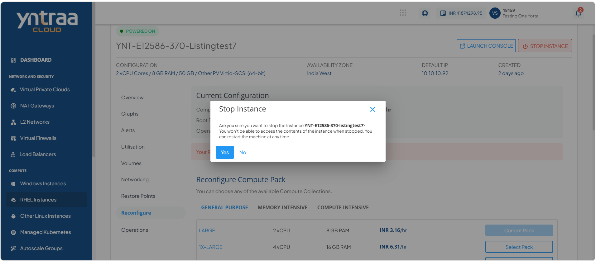
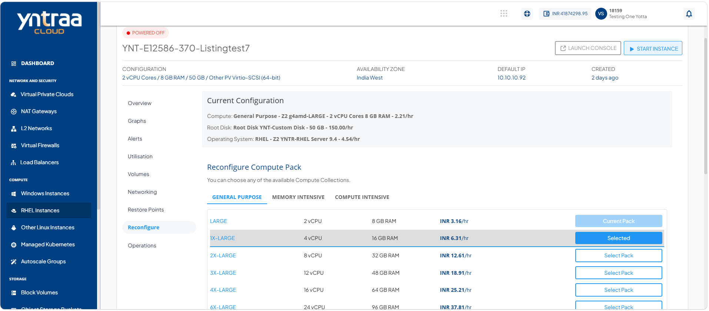
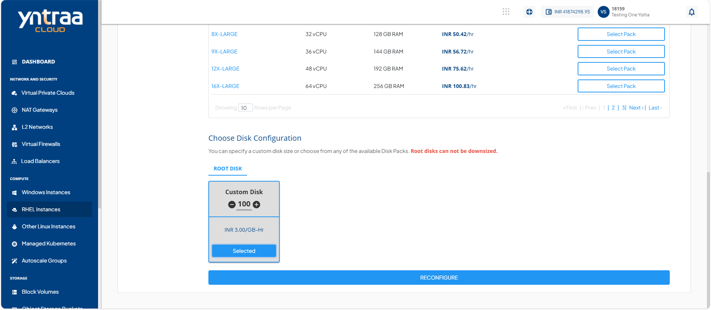
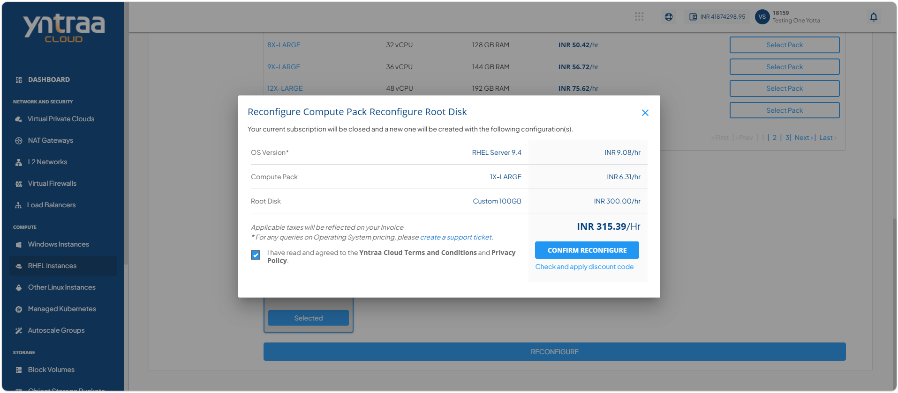

# Reconfiguring RHEL Instances

Reconfigure a window instance to change its compute and root disk configuration when your workload requirements change. Updating the compute pack and root disk allows you to allocate resources that better match your application's performance and capacity needs. 

To reconfigure the window instances, follow these steps:

1. Navigate to **Compute > RHEL Instances**. The following screen appears:
   
2. Click on your created RHEL instance from the list. The Overview tab opens automatically. The following screen appears: 
   
3. Click the **Stop Instance** button. The following screen appears:
   
4. Click the **Yes** button. The following screen appears: 
   
   
5. Select a **Compute Pack** and **Root Disk**, or customize disk to specify the required disk size. Click **Select Pack**, and then click **Reconfigure** button. The following screen appears:
    
6. Select the **I have read and agreed to the Yntraa Cloud Terms and Conditions and Privacy Policy**, and click the **Confirm Reconfigure** button.
 

