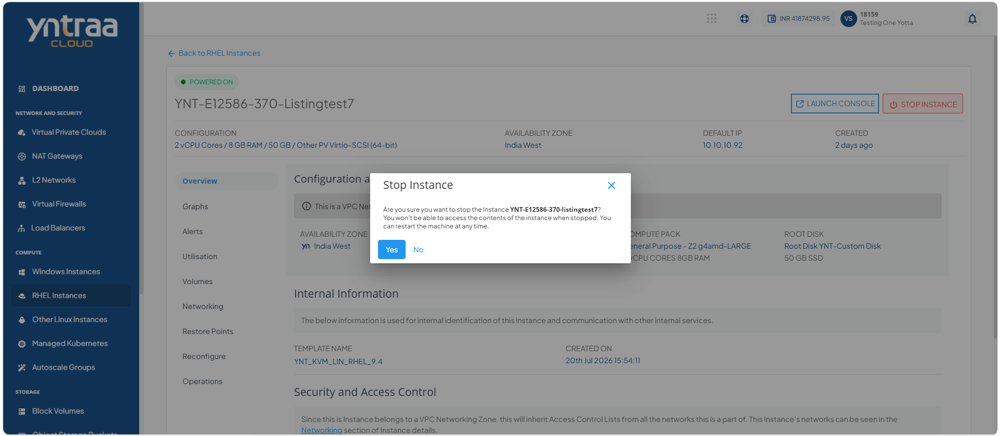
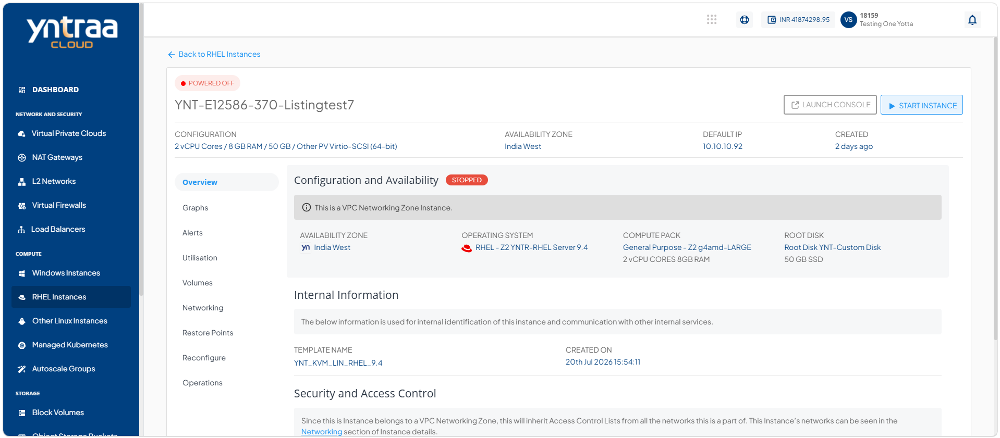
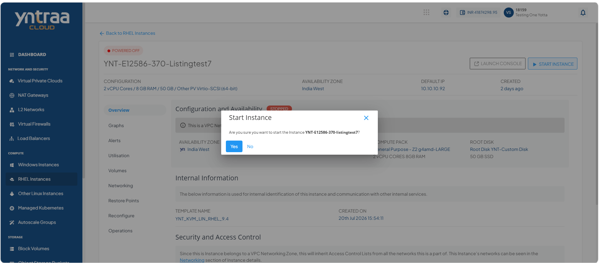

# Viewing Details of RHEL Instances 

View detailed information about a RHEL instance, including its configuration, status, networking, storage, and resource allocation. Reviewing these details helps you monitor the instance and verify its settings for effective management.

This section comprises of the following sub-sections:

  
- [Launching RHEL Instance Web Based Console](#launching-rhel-instance-web-based-console)
- [Stopping and Starting a RHEL Instance](#stopping-and-starting-a-rhel-instance)

To view the details of RHEL instances, follow these steps:

1. Navigate to the **Compute > RHEL Instances**. The following screen appears: 
   
2. Click on your created RHEL instance from the list. The Overview tab opens automatically. The following screen appears with the details: 
   

**Configuration and Availability:** This displays the following RHEL instance configuration details to help verify its current configuration and operational state:

- The instance's status **Running** or **Stopped**
- Availability Zone
- Operating System
- Compute Pack
- Root Disk

**Internal Information:** This displays the following information that is used for internal identification of the window instances and communication with other internal services:
- Template Name
- Created On

**Security and Access Control:** This displays the available security settings and access control options for the RHEL instance based on its networking zone. The available information and operations may vary depending on the configured network environment:
- Network Name
- VPC Name
- Access Control

## Launching RHEL Instance Web Based Console 

Launch the RHEL instance web-based console to access and manage your RHEL virtual machine through a web browser. The console provides a convenient way to perform administrative and management tasks on the instance.

1. Navigate to the **Compute > RHEL Instances**. The following screen appears: 
   
2. Click on your created RHEL instance from the list. The Overview tab opens automatically. The following screen appears with the details: 
   
3. Click **Launch Console**, and then provide the RHEL credentials to login and access the RHEL instance web-based console.
   
## Stopping and Starting a RHEL Instance

Stop a RHEL instance to temporarily shut it down when it is not in use, helping optimize resource usage. Start the instance whenever you need to restore access and resume running your RHEL-based applications and workloads.

To start and stop the RHEL instance, follow these steps:  

1. Navigate to the **Compute > RHEL Instances**. The following screen appears: 
   
2. Click on your created RHEL instance from the list. The Overview tab opens automatically. The following screen appears with the details: 
   
3. Click the Stop Instance button. The following screen appears: 

4. Click the **Yes** button. The following screen appears:

5. Click the Start Instance button. The following screen appears: 

6. Click the **Yes** button. The following screen appears:
  

