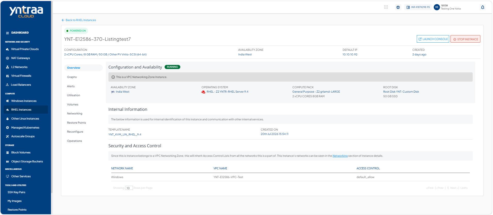
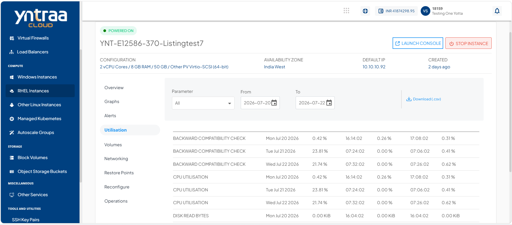

# Viewing Utilisation

Utilisation reports provide historical usage details for your RHEL instance. You can view daily maximum, minimum, and average readings across all supported parameters. The utilisation table presents this information in a clear date‑wise format, and you can download the report as a .csv file for further analysis.

To view historical usage across supported parameters, follow these steps:

1. Navigate to **Compute > RHEL Instances**. The following screen appears:
   
2. Click on your created RHEL instance from the list. The Overview tab opens automatically. The following screen appears with the details: 
   
3. Click **Utilisation**. The following screen appears: 
   

