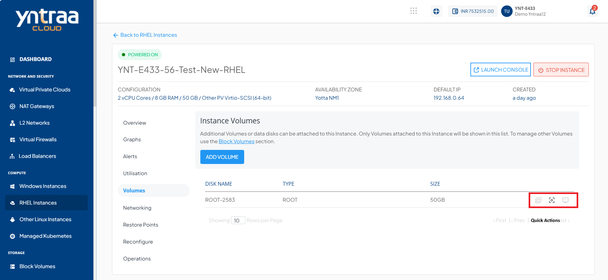
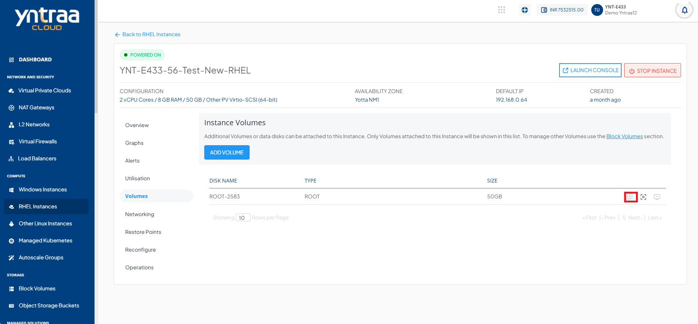
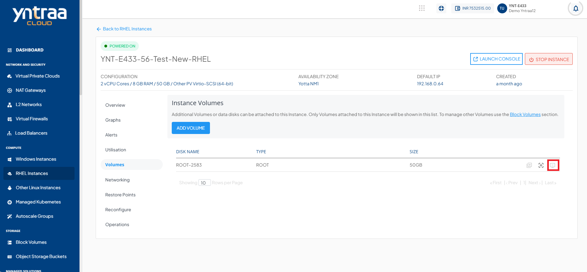

# Volume Management

To view the disks attached to particular Instance, navigate to [RHEL Instances](AboutRHELInstances.md) and access the **Volumes** tab.

## Adding Volume

To add a volume, follow these steps:

1. Click the **Add Volume** button.
2. Specify the required disk configurations, and submit it.
3. The system creates and attaches the volume to the instance.

For detailed steps, refer: [Create Data Disk](/docs/Subscribers/Storage/BlockVolumes/CreatingDataDisk).

## Quick Actions
The following are the quick actions:

- **Create Template** - Click on it, and enter the image name and description.
  
- **Create Restore Point** - Clicking on this will create a Volume snapshot.
  
- **Detach/attach** - This option attach/detach the volume to/from the instance.
 
 
:::note
Volume-level operations are available as part of the Block Volumes service.
:::

