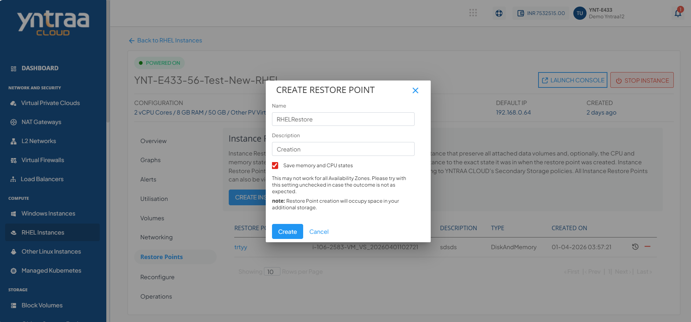
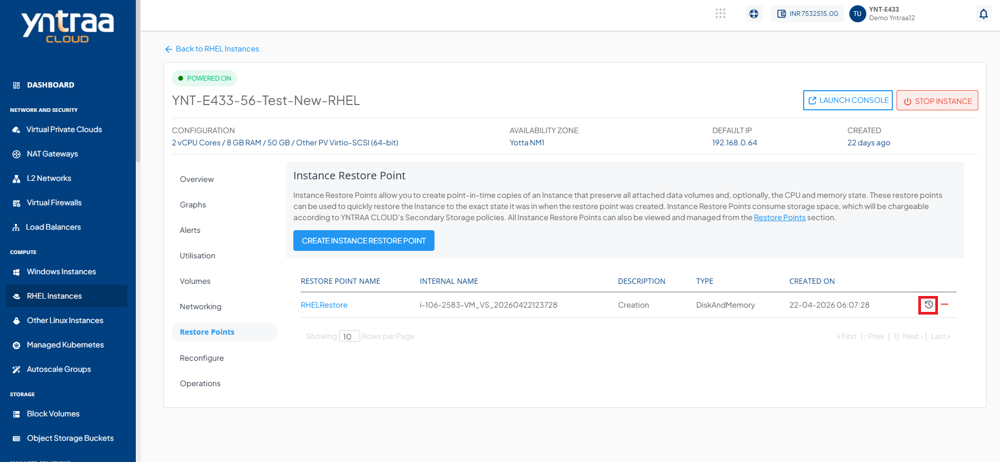
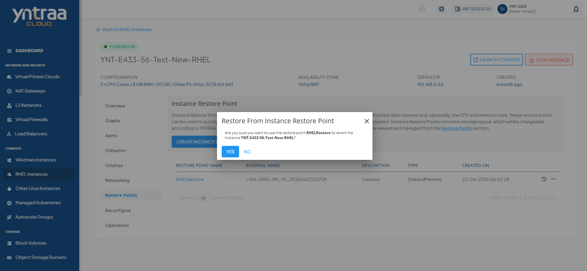
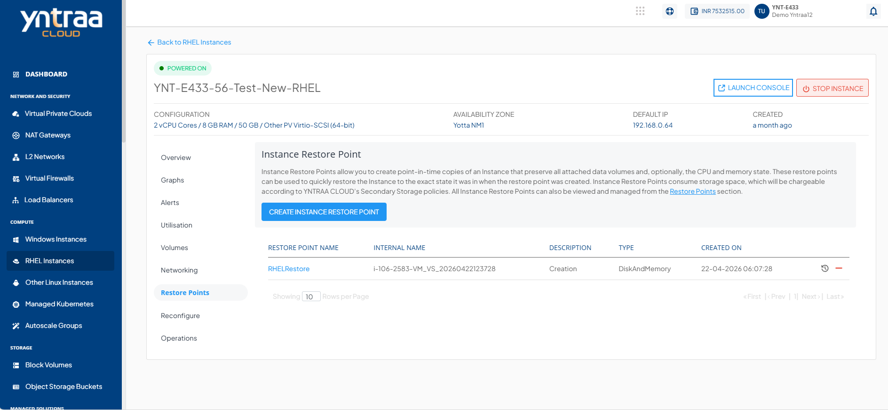

# Working with Restore Points

Instance Restore points allow you to create point-in-time images of instances that preserve all their data volume as well as (optionally) their CPU/memory states. You can use Restore points to quickly restore Instances.

The Restore points section shows all RHEL Instance Restore points, which can be used to revert the RHEL Instances to an earlier state.

To view all the Restore points taken for the Instance, navigate to a [RHEL Instances](AboutRHELInstances.md) and access the **Restore points** tab. 

Restore points list down the following details:

- Restore points name
- Internal Name
- Description
- Type
- Created On

To create a restore point, follow these steps: 
1. Click the **Create Instance Restore Point** button. The following screen appears:
   
2. Enter the **Name** and the **Description** of the restore point.
3. Click the **Create** button. The following screen appears:
   
## Quick Actions

The following are the quick actions:

- Click the **Restore from Instance Restore Point** icon, and select **Yes** . 
   
- Click the **Delete Restore Point**icon. The following screen appears: 

