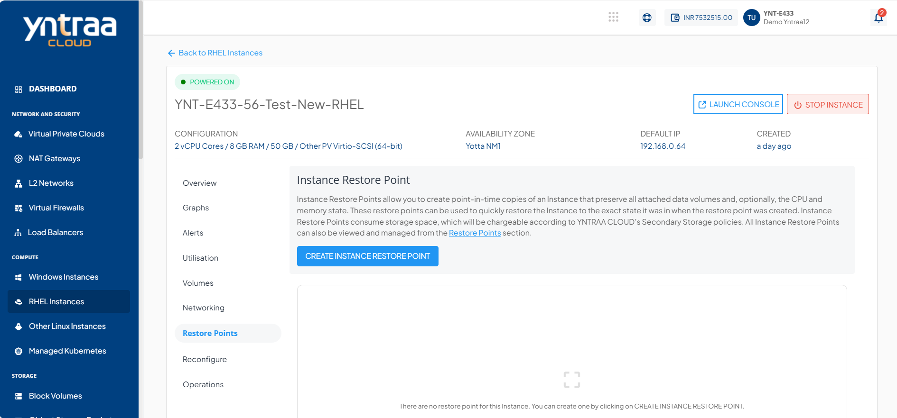
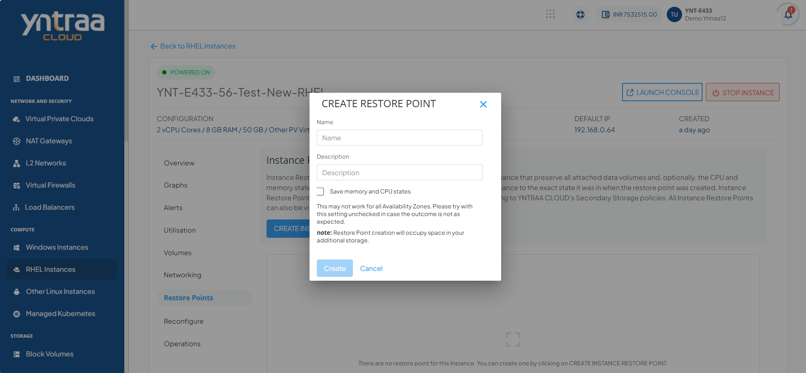

# Working with Restore Points

To view all the Restore points taken for the Instance, navigate to a [RHEL Instances](AboutRHELInstances.md) and access the **Restore points** tab.
Instance Restore points allow you to create point-in-time images of instances that preserve all their data volume as well as (optionally) their CPU/memory states. You can use Restore points to quickly restore Instances.

The Restore points section shows all RHEL Instance Restore points, which can be used to revert the RHEL Instances to an earlier state.

Restore points will list down the following details:

- Restore points name
- Internal Name
- Description
- Type
- Created On

Two quick options are available, one is to revert the Instance from the snapshot, and the other is to delete the particular snapshot.

To create a snapshot: 
1. Click the **CREATE INSTANCE RESTORE POINT** button. 
2. Enter the name and the description of the restore point.
3. Click **Create**.

