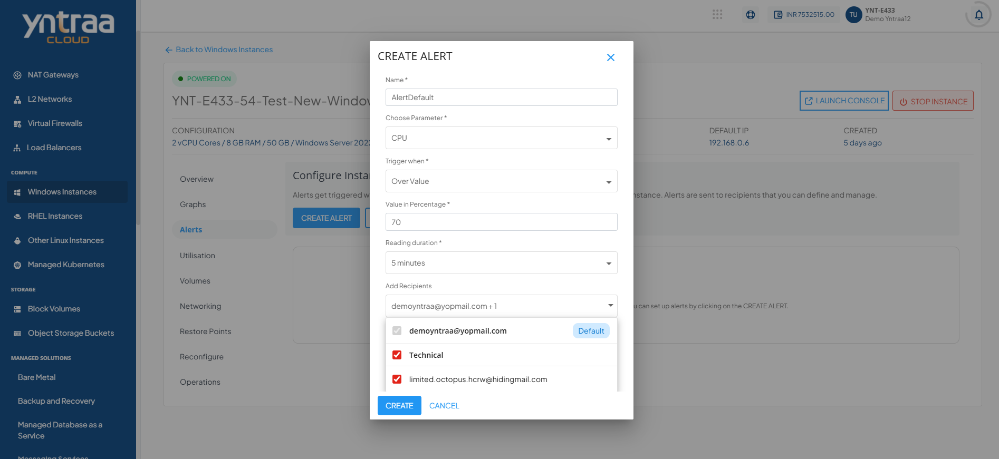
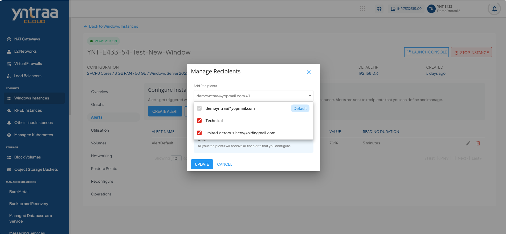

# Creating Alerts on Windows Instances

Alerts get triggered whenever a configured condition is met. You can create multiple alerts on an instance. Alerts are sent to recipients that you can define and manage.

You can configure alerts for instances running on the Yntraa Cloud console. You can define alerts for Instances and configure the email recipients for these alerts using a straightforward and easy-to-use interface.

To view the configured alerts or configure new ones, navigate to the **Compute** > [Windows Instances](/docs/Subscribers/Compute/WindowsInstances/AboutWindowsInstances), select a Windows Instance, and access the **Alerts** tab.

# Instance Alerts

You can access the Alerts tab from the instances details. It shows the alerts already configured for that particular instance with following details:
- Alert Name
- Parameter
- Trigger
- Value
- Reading Duration
# Adding an Alert

Navigate to the **Window Instances > Alerts**. The following screen appears: 

pic

You can create or add alerts simply by clicking on the **Create Alert** button. The following screen appears with the details:

The various fields of the add alert page are described below:

- **Name** - You can define the name for your alert.
- **Choose parameter** - This option allows you to define what parameter must be monitored to trigger the alert email. Yntraa Cloud supports CPU, RAM, NETWORK INPUT, NETWORK OUTPUT parameters.
- **Trigger when** - This set of options lets you define whether to trigger above or below a custom value.
- **Value in Percentage** - You can define the Value. 
- **Reading duration** - This option lets you define the breach window, i.e., the duration for which the breach has to be consistent to trigger the alert email.
- **Add Recipients** - Email IDs can be added here, or also you can add them by using the manage recipients.

# Managing Recipients

This section list and display all the email IDs already configured for the alerts. You can delete the existing email IDs and add other email IDs by following these steps:

1. Click the **Manage Recepients** button. The following screen appears:
   
2. Use the dropdown menu to select available recipients.
3. Click the **Update** button.
   

:::note
	All the managed recipients receive all setup alerts. If no email ID is configured, no email is sent for the already configured alerts.
:::

