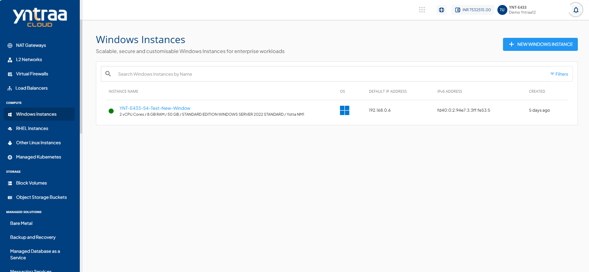
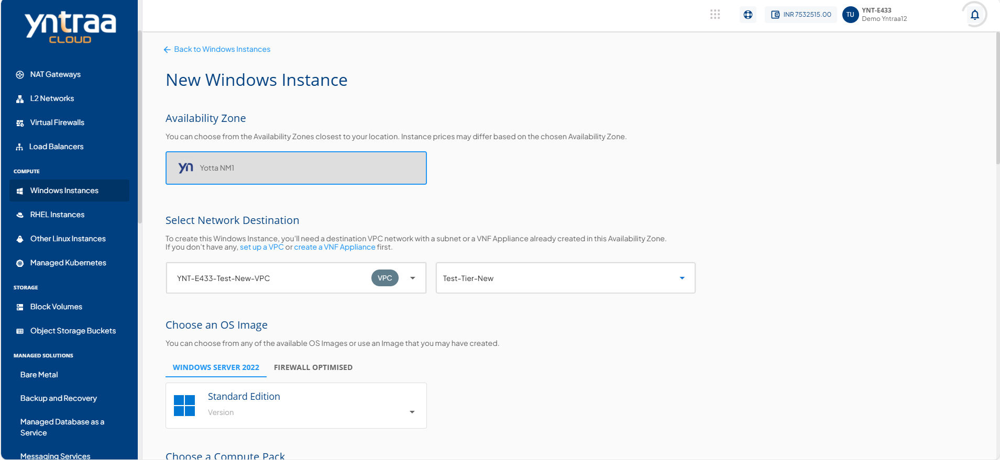
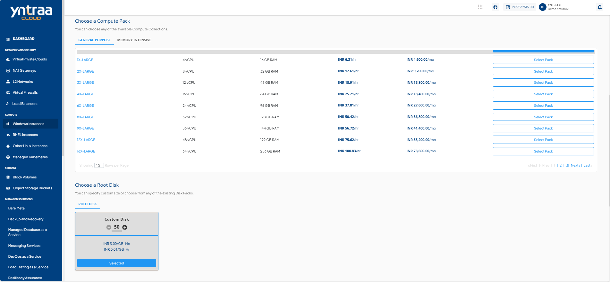
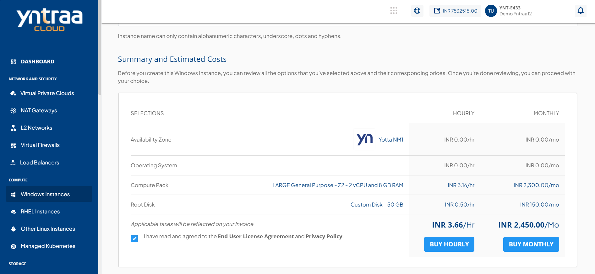
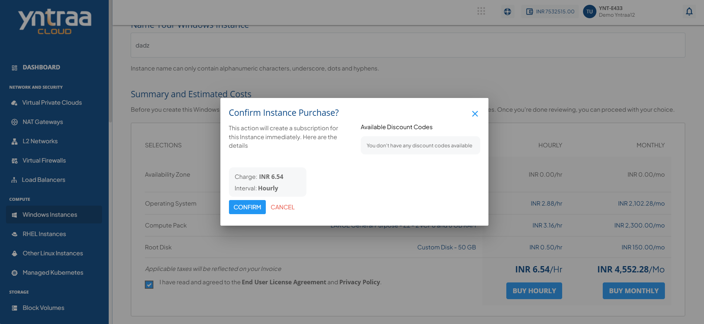

# Creating Windows Instances

Before creating a Windows Instance, it is important to plan the architecture, networking and access to the Windows Instances. 

To create a Windows instance, follow these steps:

1. Navigate to **Compute > Windows Instances**.
2. Click on the **+ NEW WINDOWS INSTANCE** button.

3. Choose an Availability Zone, which is the geographical region where your Instance deploys. 

4. Select a network destination for your instance. Choose an existing VPC from the available options and select the appropriate network tier listed under network tier dropdown.
	:::note
	To add a Windows Instance to a VPC or VNF, you need to have a VPC or VNF configured with at least one tier.
	:::
5. Select a compute pack from the available compute collections.
6. Select a root disk for your instance from the available options or choose **Custom Disk** to define the size. Adjust the disk size as required and click **Select Pack** to confirm.

7. Verify the estimated cost of your Windows Instance based on the chosen specifications from the **Summary and Estimated Costs** Section (Here, both Hourly and Monthly Prices summary are displayed).
8. Click on the check box after going through the policies mentioned by your cloud service provider.
9. Choose the **BUY HOURLY** or **BUY MONTHLY** option. A confirmation window appears and the price summary displays along with the discount codes if you have any in your account. 
    - You can apply any of the discount codes listed by clicking on the **APPLY** button. 
    - You can also remove the applied discount code by clicking on the **REMOVE** button. 
    - You can cancel this action by clicking on the **CANCEL** button.

10. Click the **CONFIRM** button to create the Windows Instance.

:::note 
This might take up to 5-8 minutes. You may use the cloud console during this time, but it is advised that you do not refresh the browser window.
:::

Once ready, you are notified of this purchase on your email address on record. To access the  newly created Windows Instances, navigate to **Compute > Windows Instances** on the main navigation panel.

