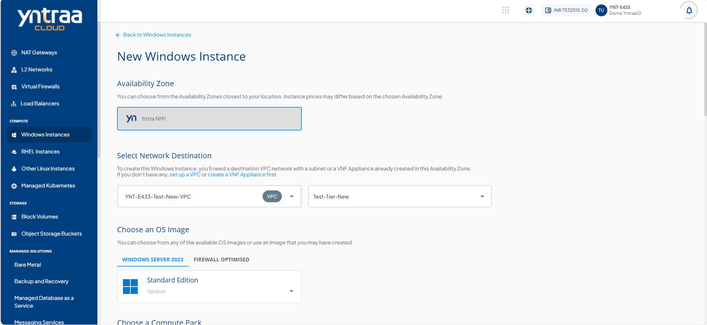
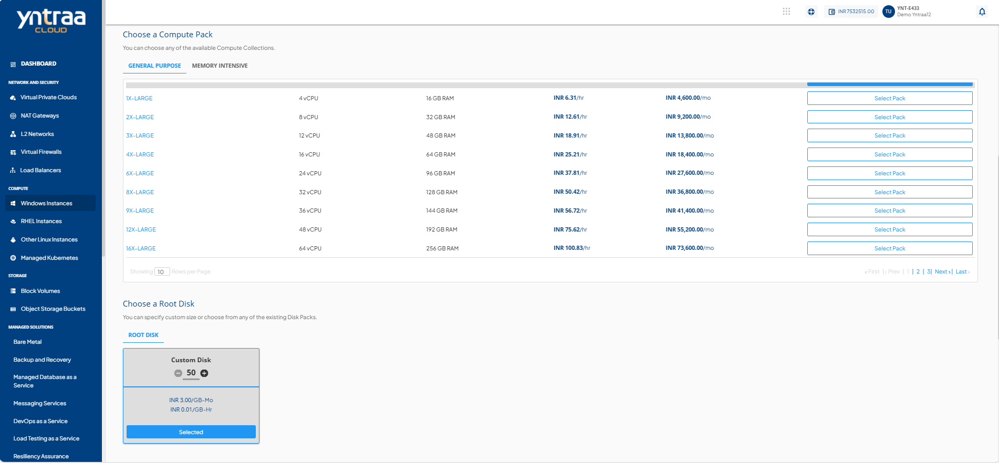
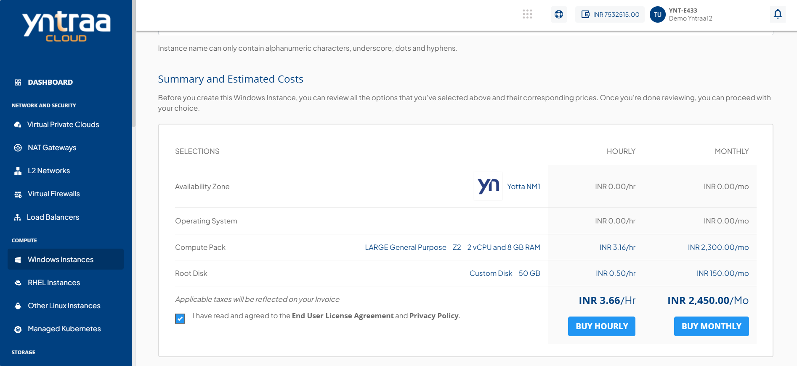
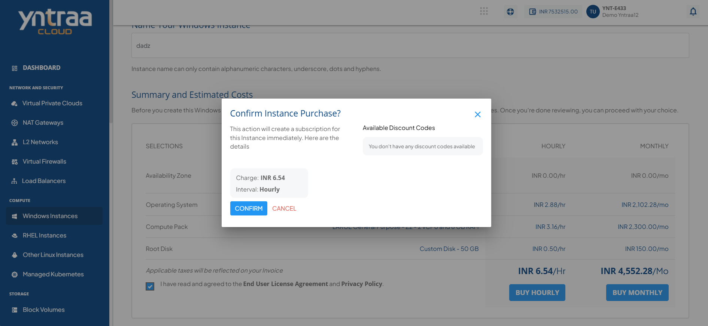

# Creating Windows Instances

Create a windows instance to deploy a virtual machine for running windows-based applications and workloads in the cloud. During creation, you configure the required compute, storage, networking, and other settings to provision an instance that meets your workload requirements.

To create a windows instance, follow these steps:

1. Navigate to the **Compute > Windows Instances**. The following screen appears: 
   
2. Click the **+ New Windows Instance** button. The following screen appears: 

3. Select Availability Zone.
4. Select a network destination for your instance. Choose an existing VPC from the available options and select the appropriate network tier listed under network tier dropdown.
    :::note
	To add a Windows Instance to a VPC or VNF, you need to have a VPC or VNF configured with at least one tier.
	:::
5. **Choose an OS Image** and select the required operating system from the available options. Choose the appropriate version based on your requirement.

6. Select a compute pack from the list.
7. Select a **Root Disk** from the available options or choose **Custom Disk** to specify the required disk size, and then click **Select Pack**.
   
8. Select the **I have read and agreed to the End User License Agreement and Privacy Policy** option, and click **Buy Hourly** or **Buy Monthly** button. The following screen appears: 
   
9. Click the **Confirm** button.

