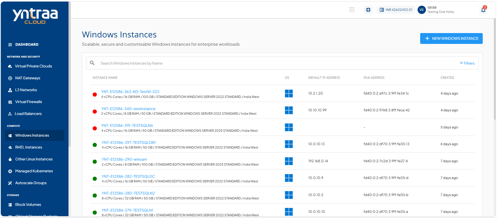
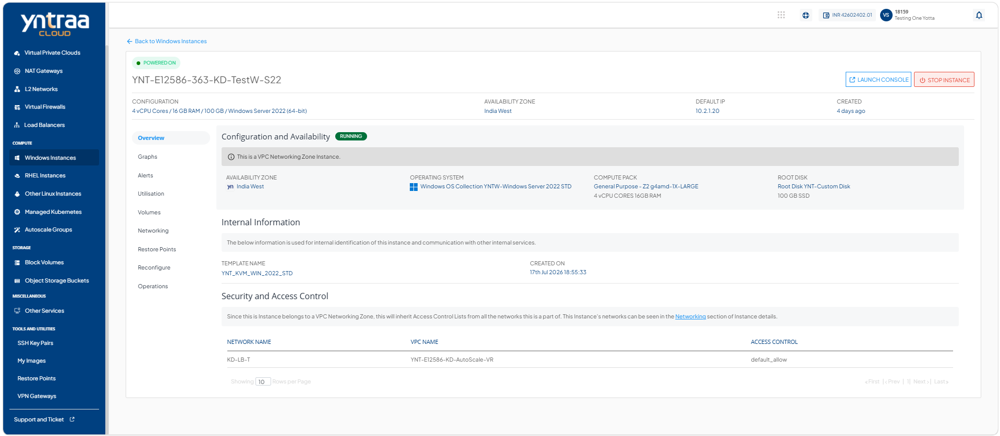
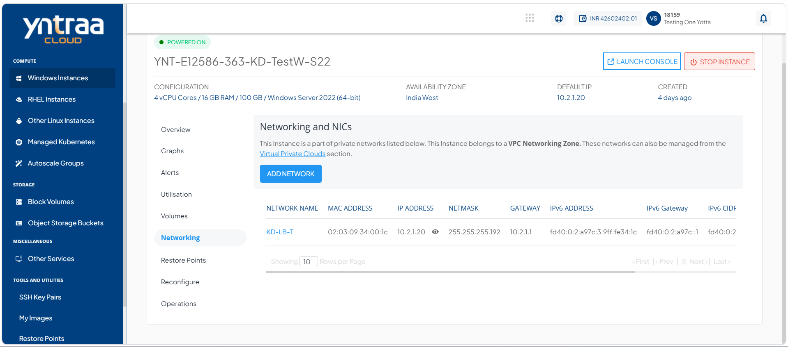
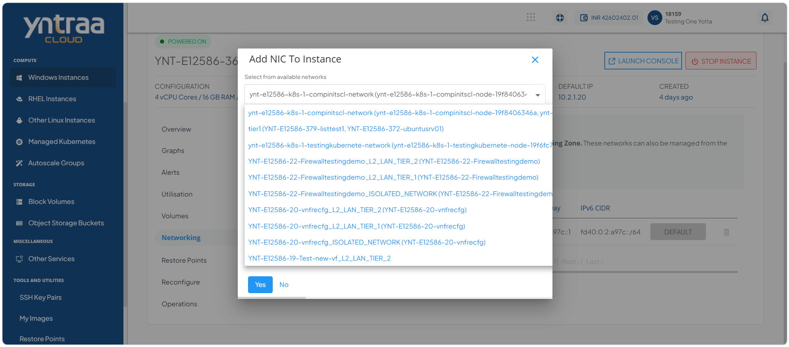
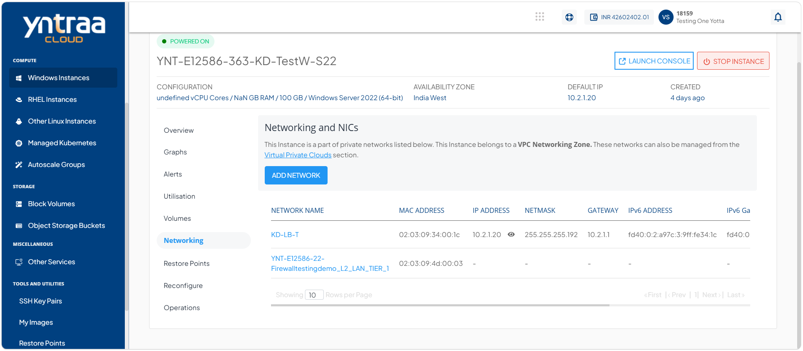

# Managing Networks

Manage the networking configuration of your Windows instance to control connectivity and communication with other resources. You can configure network settings, and manage network access to ensure secure and reliable communication for your workloads.

 To add network interface to a Windows instance, follow these steps:
 
 1. Navigate to **Compute > Windows Instances**. The following screen appears: 
   
2. Click on your created Window instance name from the list. The Overview tab opens automatically. The following screen appears: 
   
3. Click **Networking**. The following screen appears: 
   
4. Click the **Add Network** button, and select the required network from the **Select from Available Networks** dropdown. The following screen appears:
   
5. Click the **Yes** button. The following screen appears:
    

