# Managing Volume

This section provides the essential operations required to manage storage volumes and their restore points. It enables you to view attached disks, create and manage disk restore points for data protection, create additional storage volumes as needed, and remove restore points that are no longer required. These operations help ensure efficient storage management, improve data availability, and support backup and recovery workflows.

This section comprises of the following sub-sections:

  
- [Viewing Attached Disk](#viewing-attached-disk)
- [Adding Volume](#adding-volume)
- [Creating Disk Restore Point ](#creating-disk-restore-point)
- [Viewing Disk Restore Points ](#viewing-disk-restore-points)
- [Creating Volume from Disk Restore Point](#creating-volume-from-disk-restore-point)
- [Deleting a Disk Restore Point](#deleting-a-disk-restore-point)

## Viewing Attached Disk

View the disks attached to an instance to verify the storage resources associated with it. This helps you identify the attached disks, review their details, and confirm that the required storage volumes are correctly connected, enabling efficient storage management and troubleshooting.

To view the disks attached to an Instance, follow these steps: 

1. Navigate to **Compute > Windows Instances**. The following screen appears: 
   
2. Click on your created Window instance name from the list. The Overview tab opens automatically. The following screen appears: 
   
3. Click **Volumes**. The following screen appears: 
   

## Adding Volume

Adding a volume allows you to create and attach additional block storage to your cloud instances. Volumes provide persistent storage for applications, databases, and other data that must be retained independently of the instance lifecycle. You can create volumes with the required capacity and attach them to supported instances to expand available storage.

To add volume, follow these steps: 

1. Navigate to **Compute > Window Instances**. The following screen appears:
   
2. Click on your created Window instance name from the list. The Overview tab opens automatically. The following screen appears: 
   
3. Click **Volumes**. The following screen appears: 
   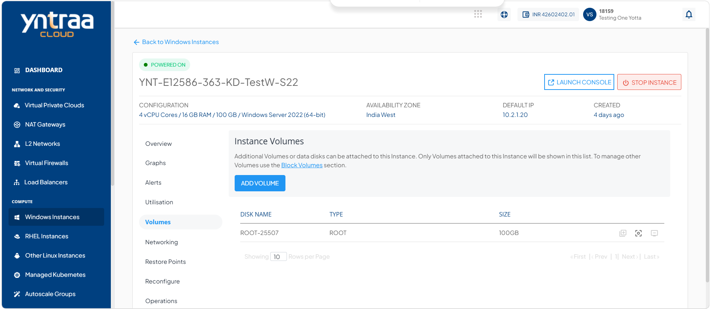
4. Click the [**Add Volume**](/docs/Subscribers/Storage/BlockVolumes/CreatingDataDisk) button to initiate the add volume procedure. 

## Creating Disk Restore Point 

Create a disk restore point to capture the current state of a disk before performing updates, configuration changes, or other modifications. A disk restore point preserves the disk data at a specific point in time, allowing you to restore the disk to that state if needed. This helps protect against accidental data loss, simplifies recovery from unexpected issues, and ensures business continuity with minimal downtime.
:::note
Restore Point creation will occupy space in your additional storage.
:::

To create the disk restore point, follow these steps: 

1. Navigate to **Compute > Windows Instances**. The following screen appears: 
   
2. Click on your created Window instance name from the list. The Overview tab opens automatically. The following screen appears: 
   
3. Click **Volumes**. The following screen appears: 
   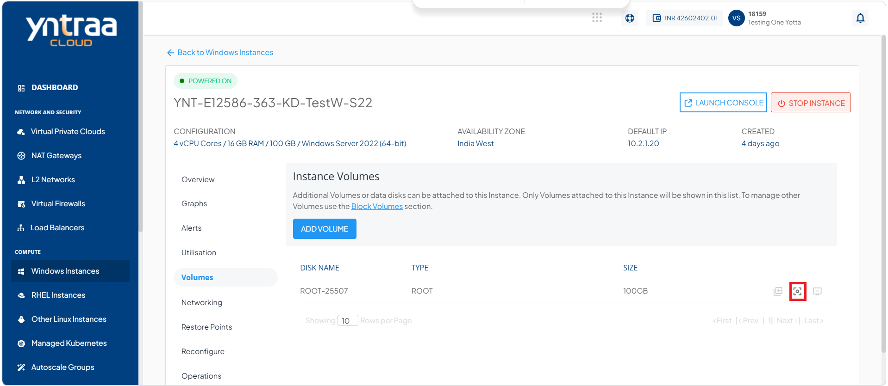
4. Click the **Create Restore Point** icon (highlighted in red). The following screen appears: 
   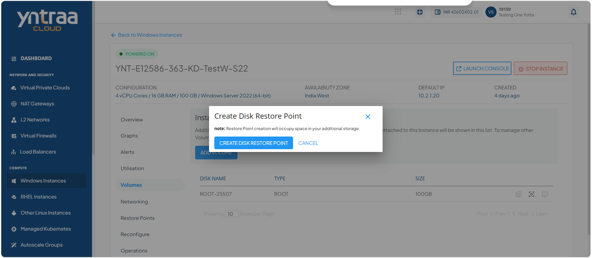
5. Click the **Create Disk Restore Point** button. The disk restore point is created.
    

## Viewing Disk Restore Points

View disk restore points to monitor the available recovery snapshots created for a disk. Reviewing restore points helps you verify backup availability, identify restore points based on their creation time, and select the appropriate recovery point when restoring a disk. This ensures you can quickly recover disk data to a known good state whenever required.

To view the disk restore point, follow these steps: 

1. Navigate to **Tools and Utilities > Restore Points**. The following screen appears:
   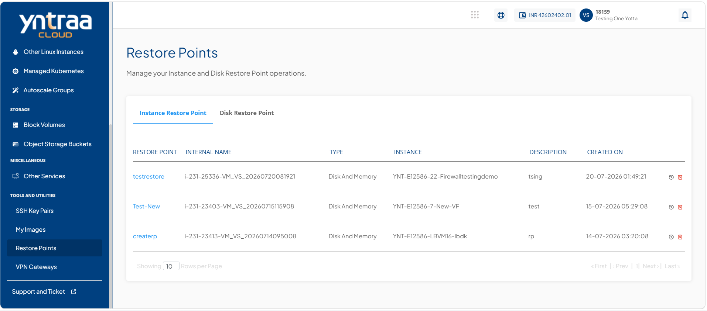
2. Click **Disk Restore Point**. The following screen appears: 
   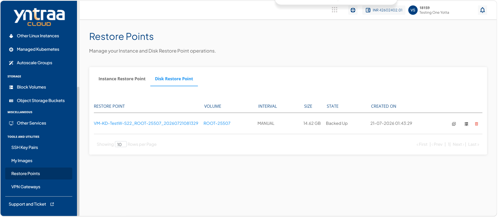

## Creating Volume from Disk Restore Point

Create a volume to provision additional block storage for your cloud resources. Volumes provide persistent storage that can be attached to instances to expand storage capacity, host application data, or separate data from the operating system. Creating dedicated volumes improves storage flexibility, simplifies data management, and allows independent backup, restore, and lifecycle management without affecting the associated instance.

To create volume from disk restore point, follow these steps: 

1. Navigate to **Compute > Windows Instances**. The following screen appears: 
   
2. Click on your created Window instance name from the list. The Overview tab opens automatically. The following screen appears: 
   
3. Click **Volumes**. The following screen appears: 
   
4. Click the **Create Restore Point** icon (highlighted in red). The following screen appears: 
   
5. Click the **Create Disk Restore Point** button. 
6. Navigate to **Tools and Utilities > Restore Points**. The following screen appears: 
   
7. Click **Disk Restore Point**. The following screen appears: 
   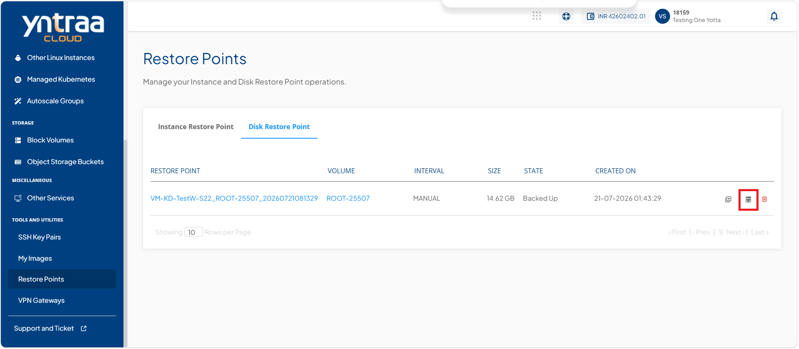
8. Click the **Create Volume** icon (highlighted in red) corresponding to the required disk restore point. The following screen appears: 
   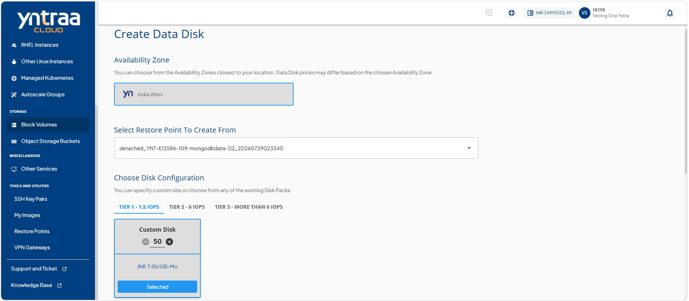
   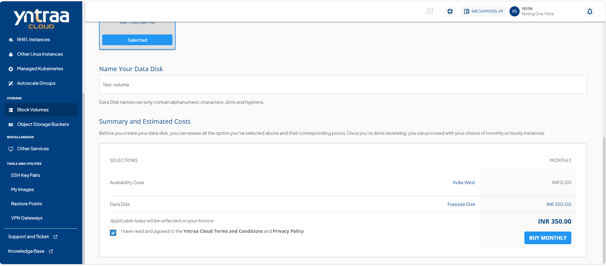
9. Select availability zone.
10. Select the instance from the dropdown for which you want to create a restore point.
11. In the **Choose Disk Configuration** section:
    - Select the desired disk tier (**Tier1, Tier2, or Tier3**).
    - Click the **Custom Disk** option and adjust the disk size using the plus (+) or minus (–) controls as per requirement.
    - Click the **Select Pack** to choose the configured disk pack.
12. Enter the disk name in **Name Your Data Disk**. 
13. Select the **I have read and agreed to the Yntraa Cloud Terms and Conditions and Privacy Policy** option, and click **Buy Monthly** button. The following screen appears: 
   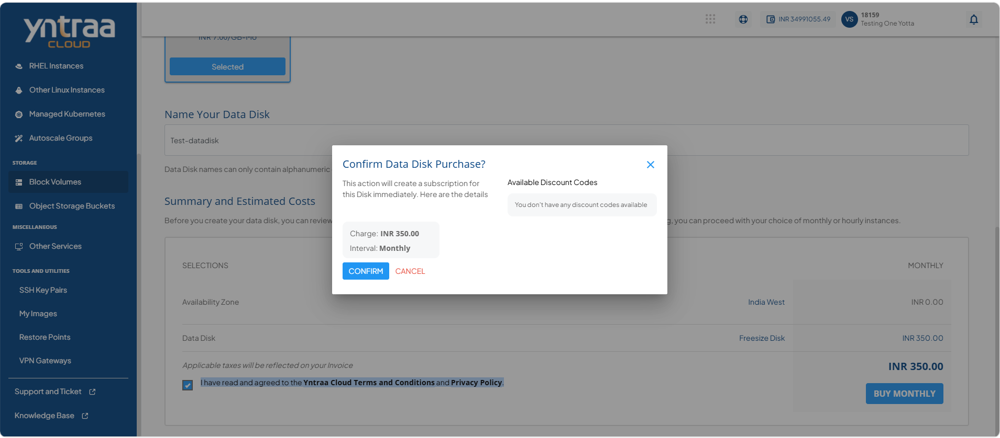
14. Click the **Confirm** button. The data disk is created.
    
## Deleting a Disk Restore Point

Delete a disk restore point when it is no longer required to free up storage resources and simplify restore point management. Removing outdated or unnecessary restore points helps maintain an organized backup environment while ensuring that only relevant recovery points are retained.
:::warning
This action can not be reversed.
:::

To delete a disk restore point, follow these steps: 

1. Navigate to **Tools and Utilities > Restore Points**. The following screen appears: 
   
2. Click **Disk Restore Point**. The following screen appears:
   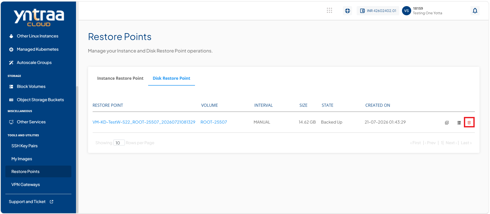
3. Click the  **Delete Disk Restore Point** icon (highlighted in red). The following screen appears: 
   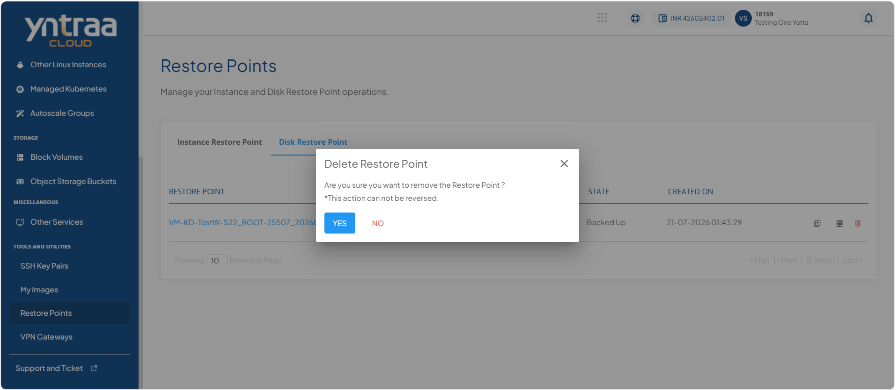
4. Click the **Yes** button. The disk restore point is deleted.

