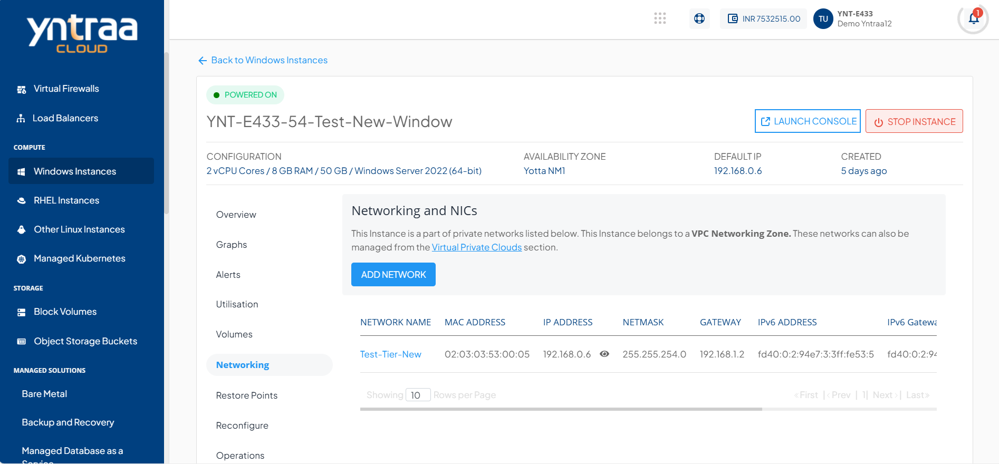

# Networking Management on Windows Instances

 To add network interface (NIC) to a Windows instance in the Yntraa Cloud console, follow these steps:
1. Navigate to **Compute** > [Windows Instances](AboutWindowsInstances). The following screen appears: 
2. Select a Windows Instance, and access the **Networking** tab. The following screen appears 
3. Click the **Add Network** button. The following screen appears:  
    - Click the **Tier** dropdown, and select the required network from the list.
    - Click the **Yes** button to confirm.
      
:::note
If the Instance is inside a VPC, you can associate it with multiple tiers within the VPC or share it with other VPC networks in the same Availability Zone by using the **Add Network** option.
:::

4. Click the **Delete** icon to delete an existing network or tier association from this section.
   

:::note
Advanced networking configurations can be done using the Virtual Private Cloud service.
:::

