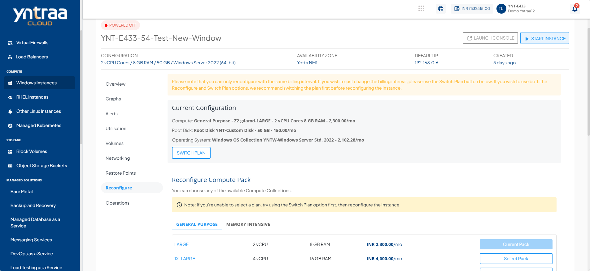

# Reconfiguring Windows Instances

Reconfiguring Windows instances enables you to adapt resources and billing options to meet changing workload demands. You can modify the compute pack and root disk for better performance and storage, as well as switch the billing interval between monthly and hourly plans to optimize cost and flexibility.

## Reconfiguring Compute Pack and Root Disk

Reconfiguring a Windows instance lets you update its compute resources and root disk size to match your performance and storage needs.

To reconfigure compute pack and root disk, follow these steps:
1. Navigate to **Compute** > [Windows Instances](AboutWindowsInstances). The following screen appears: 
2. Select a Windows Instance, and access the **Reconfigure** tab. The following screen appears: 
3. Click the **Stop Instance** button. The status changes to **Powered Off**.
4. To reconfigure the current compute pack, select the desired option from the list, and click the **Reconfigure Compute Pack** button. 
5. You can specify the custom disk size by clicking the **"+"** or **"-"**  icon.
	
6. Click the **Reconfigure Root Disk** button.
   
## Changing the Billing Interval

Changing the billing interval allows you to switch between monthly and hourly plans based on your usage and cost preferences.

To change the billing interval, follow these steps:
   
1. Navigate to **Compute > Windows Instance**. The following screen appears: 
2. To change the billing interval between monthly and hourly, click the **Switch Plan** button. 
3. Select the **I have read and agreed to the end user license agreement and privacy policy** option.
4. Click **Confirm Switch** button.
   
:::note
You can only reconfigure with the same billing interval. To change the billing interval, use the **Switch Plan** button. It is recommended to switch the plan before reconfiguring the Instance if you wish to use both the Reconfigure and Switch Plan options. You will be charged as per the pack you have reconfigured, not based on the older pack.
:::

