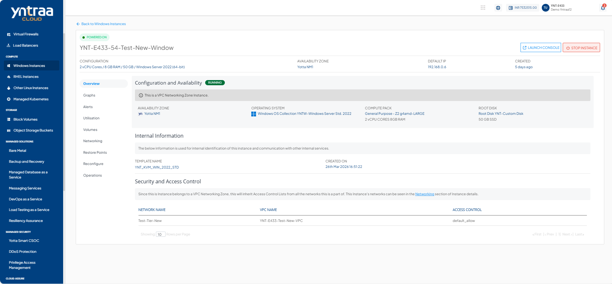

# Viewing Details of Windows Instances

To view the details of Windows Instances, navigate to [Operating Windows Instances](AboutWindowsInstances), select a Windows Instance and access the **Overview** tab.

1. Configuration and Availability
    1. The instance's status, **RUNNING**, is displayed in Green , whereas **STOPPED** is displayed in red out.
    2. Information about the networking zone.

2. Internal Information - This displays the information that is used for internal identification of this instance and communication with other internal services.
    - Template Name
    - Created On
3. Security and Access Control- Depending on the networking zone, the information and operations will be available here.
-  If it's a VPC Networking zone, then you can view the below information:
    - Network Name
    - VPC Name
    - Access Control

