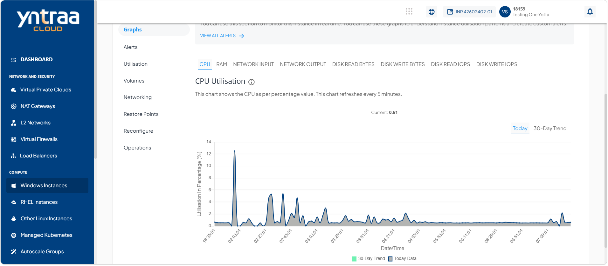

# Viewing Graphs

Graphs provide a visual representation of the performance and resource utilization of your Windows instance. You can monitor key metrics such as CPU, memory, network traffic, and disk activity over time to track usage patterns, identify performance trends, and help ensure the instance operates efficiently.

To view graphs, follow these steps: 

1. Navigate to **Compute > Windows Instances**. The following screen appears: 
   
2. Click on your created window instance from the list. The Overview tab opens automatically. The following screen appears: 
   
3. Click **Graphs**. The following screen appears: 
   
