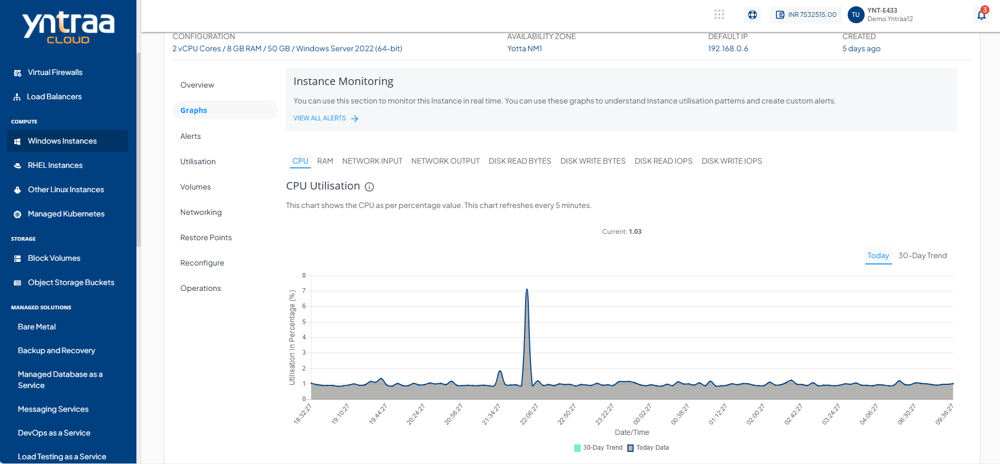

# Viewing Graphs and Utilisation of Windows Instances

Monitoring the performance of your Windows Instances is essential for ensuring optimal resource utilisation and system stability. The **Graphs** and **Utilisation** sections provide both real-time insights and historical data, enabling you to track performance trends, analyse resource consumption, and make informed decisions for scaling and alert configuration.

## Graphs (Real-time)

To view the available graphs and monitor the instance in real-time, navigate to [Windows Instances Screen](AboutWindowsInstances), select a Windows Instance, and access the **Graphs** tab.

You can use these graphs to understand Instance utilisation patterns and create custom alerts.

The following graphs are available on a 24-hour time-scale graph with a 30-day trend line for the following parameters:

- CPU 
- RAM 
- Network Input
- Network Output
- Disk Read Bytes
- Disk Write Bytes
- Disk Read IOPS
- Disk Write IOPS

## Utilisation (Historical)

 To view historical usage across supported parameters, navigate to [Windows Instances](AboutWindowsInstances), select a Windows Instance and access the **Utilisation** tab.

The Utillisation table shows a historical date-wise details of daily maximum, minimum, and average readings for all parameters. The utilisation report is downloadable as a .csv file.

