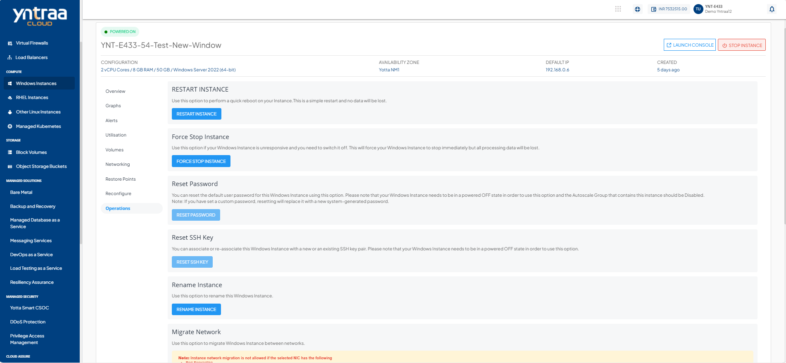
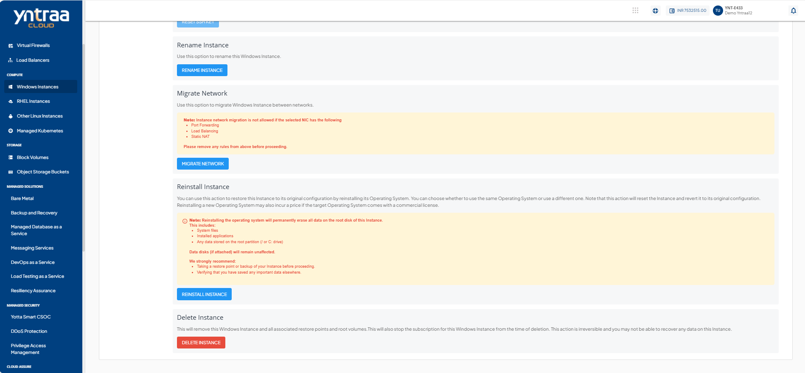

# Windows Instance Operations

To view all available Instance operations, navigate to the [Windows Instances Screen](AboutWindowsInstances), select a Windows Instance, and access the **Operations** tab.

Yntraa cloud console provides the options to perform common operations on Windows Instances.

- **RESTART INSTANCE** - Use this option to perform a quick reboot on your Instance. This is a simple restart, and no data is lost.
- **FORCE STOP INSTANCE**- To force stop a running or a hung Windows Instance.
- **RESET PASSWORD**- To reset the Windows Instance root user password. This requires the Linux Instance to be powered off.
- **RESET SSH KEY**- To reset SSH key. 
- **RENAME INSTANCE** - To rename the Windows Instance.
- **MIGRATE INSTANCE** - To migrate Windows Instance between VPC networks within the same Availability Zone.
- **REINSTALL INSTANCE** - To restore this Instance to its original configuration by reinstalling its Operating System or choosing a new one. Selecting a priced Operating System image may incur additional charges.
- **DELETE INSTANCE** - To delete the Windows Instance. 
	:::note 
	Deleting a Windows instance removes it entirely along with its subscription and is a non-reversible action.
	:::

