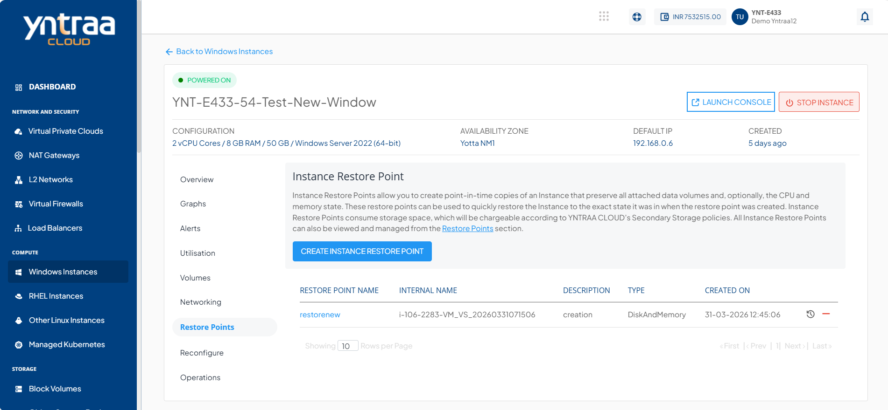
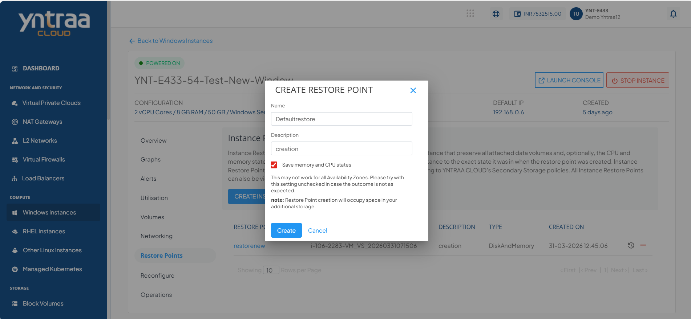

# Working with Windows Instance Restore Points

To view all the Restore Points taken for the Instance, navigate to [Windows Instances Screen](AboutWindowsInstances), select a Windows Instance, and access the **Restore Points** tab.

Instance Restore Points allow you to create point-in-time images of Instances that preserve all their data volume and (optionally) CPU/memory states. You can use Restore Points to restore Instances quickly.

The Restore Points section shows all Windows Instances Restore Points, which can be used to revert the Windows Instances to an earlier state.

Restore point shows the following details:
- Restore Point Name
- Description
- Internal Name
- Type
- Created On
 
Two quick options are available, one is to revert the Instance from the restore point, and the other is to delete the particular restore point.

- Click the **CREATE INSTANCE RESTORE POINT** button.
- Specify the name and the description of the restore point.
- To create a Restore Point, click **Create** button.

