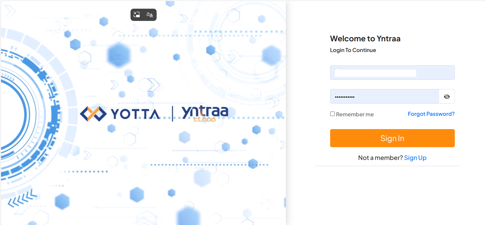

# Getting Started

After completing the sign-up process, the user receives an email with the details to access the Cloud Console.

## Accessing the Console

To access the Yntraa Cloud Console, open the [Sign In](https://uatidpcloud.yotta.com/realms/myaccount/protocol/openid-connect/auth?client_id=yntraa-prod-fe&redirect_uri=https%3A%2F%2Fportal.yntraacloud.ai%2Fauth-callback&response_type=code&scope=openid+profile+email&state=9162e42096eb43a797f32187cd0938b0&code_challenge=80No21C3czvOokBCVScmul7oDSwY8puFo2wZkbybRNg&code_challenge_method=S256) URL using your registered email address and password.

## Deploying Virtual Private Cloud

The service provider provisions a Virtual Private Cloud (VPC) and configures the firewall as the initial step in resource provisioning. This setup enables network tier configuration, configuring security rules, and establishment of secure network connectivity before deploying any applications. For more information on VPC [click here](/docs/category/about-vpc-instances).

## Creating Network Tiers for Management Components

The Service Provider creates and configures the following components:
- Firewall Management Network Tier 
- WAN Network Tier Firewall HA1(Config Sync), HA2 (Heartbeat), HA3 (Additional Heartbeat/Session Sync) Network Tier
- Monitoring Agents 
- Management Tools 
- Customer LAN Network Tiers 
- Network Policies for the Tiers  
## Adding IPs 
  
After creating a network tier, the service provider assigns IP addresses to it. These IP addresses are used to access and manage various components within the VPC. It is recommended to allocate a minimum of six IP addresses to the account for the following purposes:

- Firewall HA management
- WAF management (optional)
- Application publishing
## Deploying Virtual Firewall in Respective Tiers 

The service provider then performs the following tasks:

- Deploys firewall virtual appliances across the Management, WAN, and HA1/HA2/HA3 network tiers.
- Deploys the operational bastion host within the appropriate network tier.
  
## Validation and Verification
 
The service provider performs the following activities:

- Verifies the firewall HA status (Active/Passive or Active/Active).
- Validates north–south and east–west traffic flow.
- Confirms GUI accessibility through the management tier.
- Conducts failover testing to ensure high availability functionality.
  
## Creation of Customer Workload Instance

Refer to [Compute](/docs/category/compute) for detailed instructions on creating production virtual machines to host customer application workloads.
