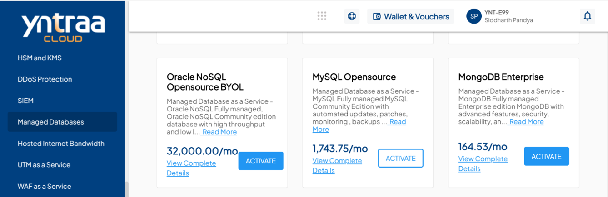
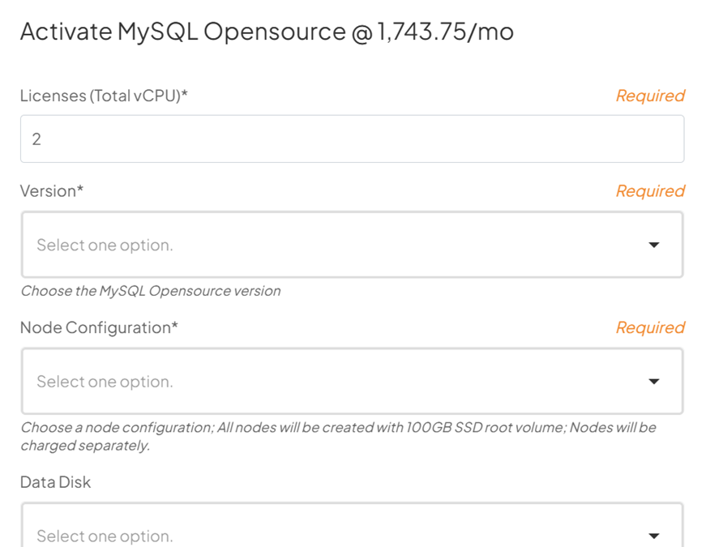
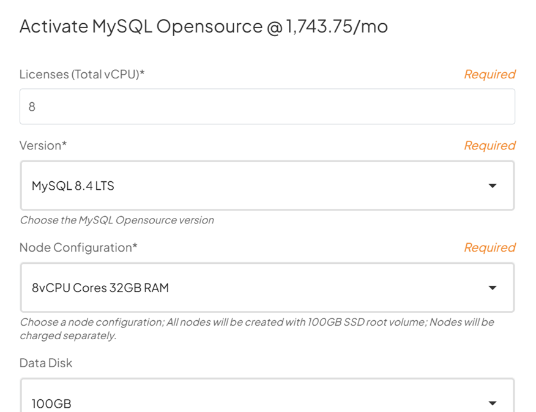
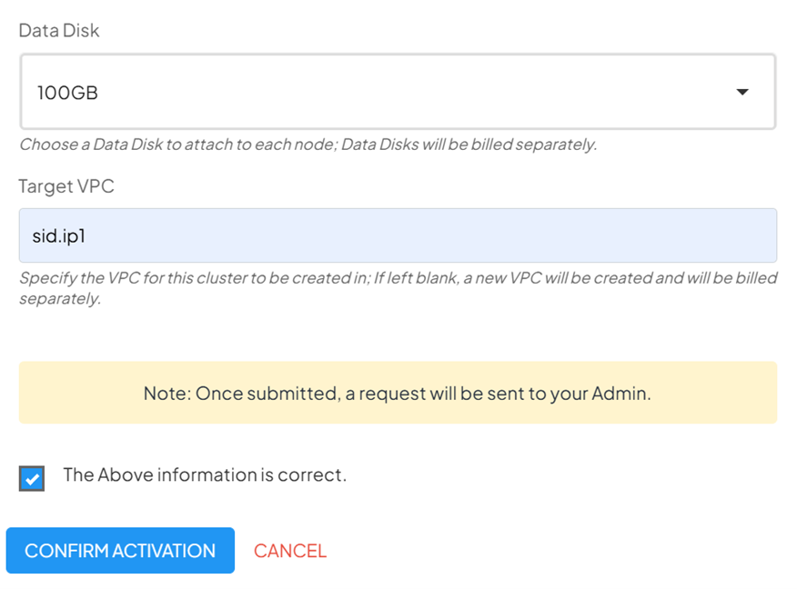
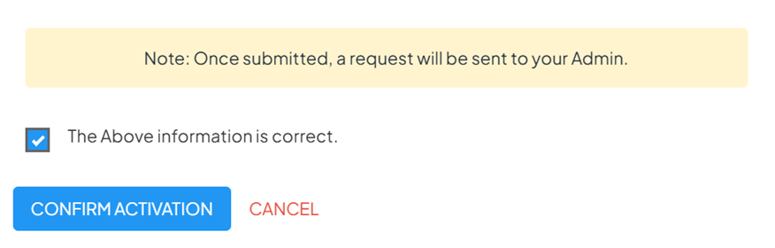

# Service Provisioning 
To initiate provisioning, follow these steps:
1. **Navigate** to Other Services/QuickPlan
2. **Select** Managed Database as a Service.
	
3. **Select** the database of choice.
4. **Click** Activate.
	
	This action opens the database provisioning request form.
## Provisioning Request Form – Field-Level Explanation
You must complete the provisioning form accurately. Each field directly impacts the final deployment architecture.
	
**Licensing Details**: For databases requiring licenses be it open-source or enterprise:
- Enter the **license quantity** based on: **Unit of measurement (for eg: Total vCPU or Total GB RAM) × Number of Nodes**
- Certain databases mandate a **minimum of 3 nodes** for clustered deployments.

**Version of Database**: We support Latest (N), N-1 & N-2 versions of any database. You can select any from the drop-down menu.

**Node Configuration**: Define the compute configuration for each database node:
- Number of nodes
- vCPU allocation per node
- Memory allocation per node (as per available instance types)

These selections determine:
- Performance capacity
- High availability behaviour
- Total licensing requirements

**Storage Configuration (Data Disk)**: Specify storage requirements for database data:
- Data disk size
- Storage type (as per available options)
:::note 
- Storage sizing should account for data growth and backup overhead.
- Storage expansion may require a change request post-deployment.
:::

**Network Configuration**: Select the target network for deployment.
- Choose the **VPC** where the database will be deployed
- Confirm subnet availability
:::note 
Database services are deployed within private networks by default.
:::
	
**Review and Validation**: Before submission, Review all entered details carefully and Validate licensing, node count, and storage selections.

Once validated:
- Click **Check** to validate the request
- Click **Confirm** to submit the provisioning request
	
	
**Backend Validation and Deployment**: After submission, the request is routed to Yntraa backend systems and Validation checks are performed for:
	- Resource availability
	- Licensing compliance
	- Architecture feasibility
- Deployment is initiated by Yntraa automation and operations teams
- Database software is installed, configured, and validated

You may be contacted if:
- Additional clarification is required
- Corrections are needed in the submitted request
## Provisioning Status and Confirmation
- You can track the request status via the Yntraa Cloud Console or support communications.
- Once deployment is completed:
	- You receive confirmation
	- Database access details and connection information are shared as per the service plan

:::note 
Provisioning timelines vary depending on database type, cluster size, and licensing validation.
:::