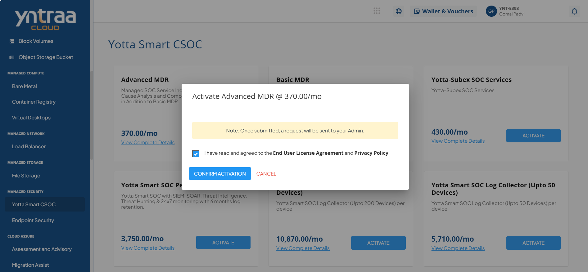

# Yotta Smart CSOC

To activate the desired yotta smart CSOC service, perform the following steps:
1. Navigate to **MANAGED NETWORK** > **Load Balancer
2. Click the **ACTIVATE** button.
   3. Select the I have read and agreed to the **End User License Agreement** and **Privacy Policy** option, and click **CONFIRM ACTIVATION** button.

For more information about the Yotta smart CSOC service, 