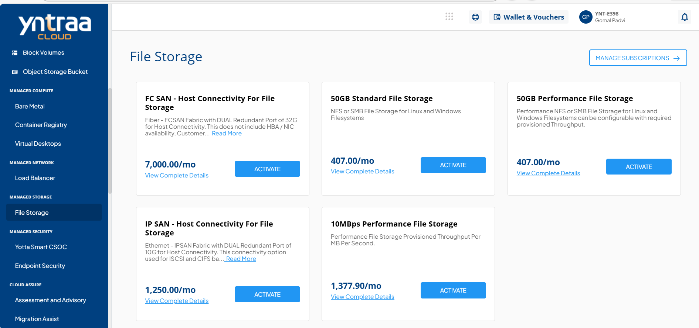
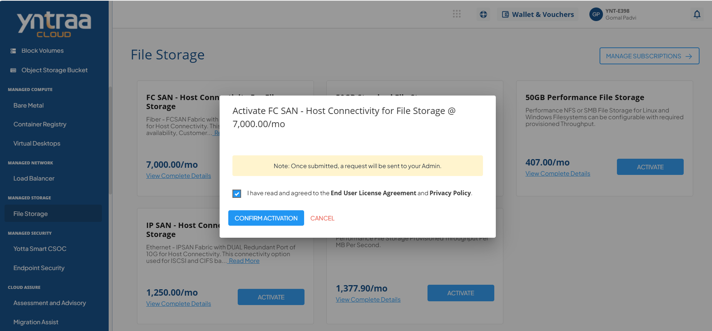

# File Storage

File Storage organizes data in a hierarchical structure similar to traditional network drives, enabling easy file sharing and collaboration. It is ideal for document storage, shared workspaces, and everyday file access across users and applications.

To activate the desired file storage service, perform the following steps:
1. Navigate to **MANAGED NETWORK** > **File Storage**
2. Click the **ACTIVATE** button.
   3. Select the I have read and agreed to the **End User License Agreement** and **Privacy Policy** option, and click **CONFIRM ACTIVATION** button.

For more information about the File storage service, 