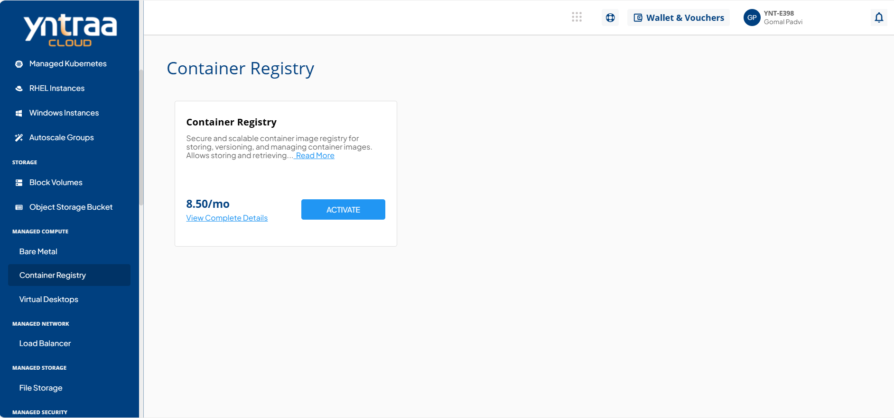
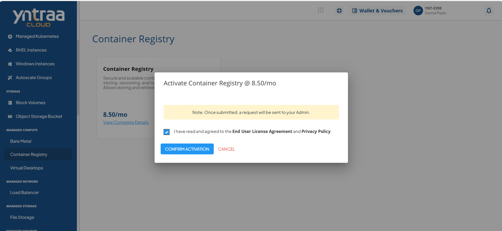

# Container Registry

To activate the desired Container Registry service, perform the following steps:

1. Navigate to **MANAGED COMPUTE** > **Container Registry**.
2. Click the **ACTIVATE** button.
3. Select the I have read and agreed to the **End User License Agreement** and **Privacy Policy** option, and click **CONFIRM ACTIVATION** button.
   
   Once submitted, a support ticket will be automatically generated for the operations team for further processing.
   
