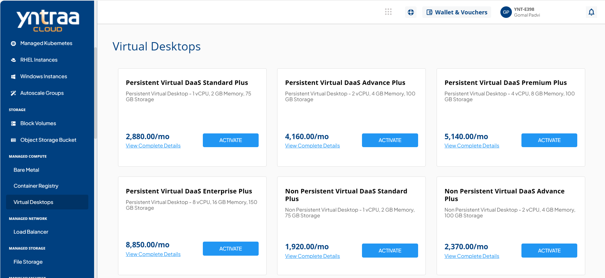
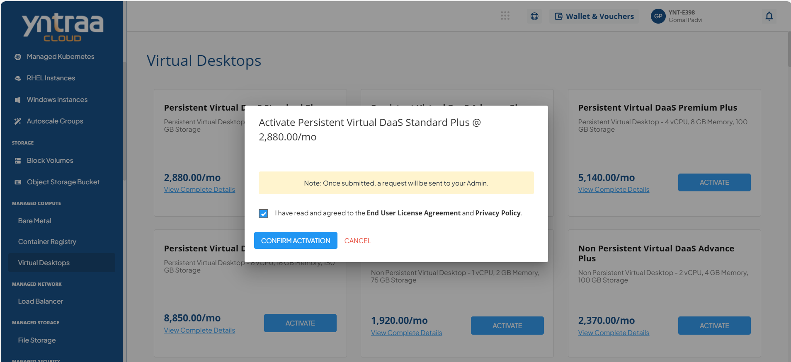

# Virtual Desktops

Virtual Desktop is a cloud-delivered desktop solution that enables secure access to applications and workspaces from any device, anywhere. Designed for modern hybrid work environments, it offers centralized management, enterprise-grade security, and scalable performance, helping organizations enhance productivity while optimizing IT costs.

To activate the desired Virtual Desktop service, perform the following steps:
1. Navigate to **MANAGED COMPUTE** > **Virtual Desktops**. 

2. Click the **ACTIVATE** button.

3. Select the I have read and agreed to the **End User License Agreement** and **Privacy Policy** option, and click **CONFIRM ACTIVATION** button.
   
   Once submitted, a support ticket will be automatically generated for the operations team for further processing.

For more information about the Virtual Desktop service, [click here](downloads/VirtualDesktopService.pdf).

