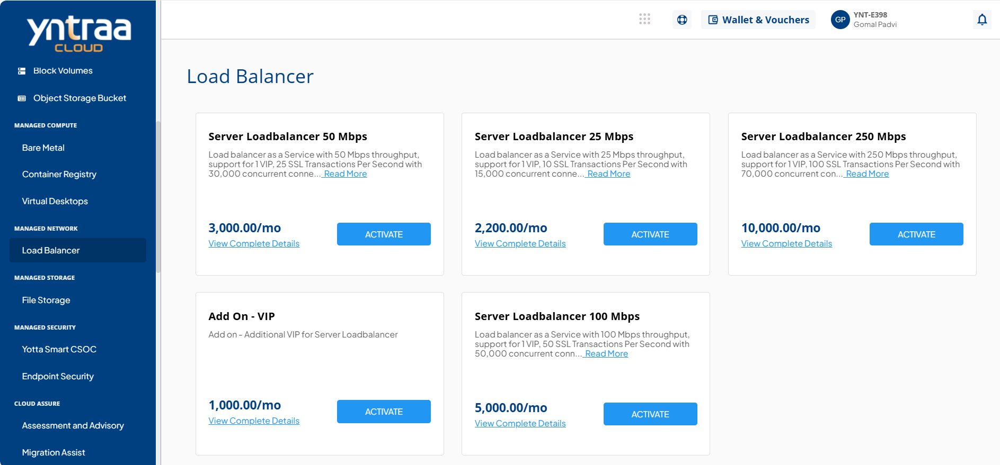
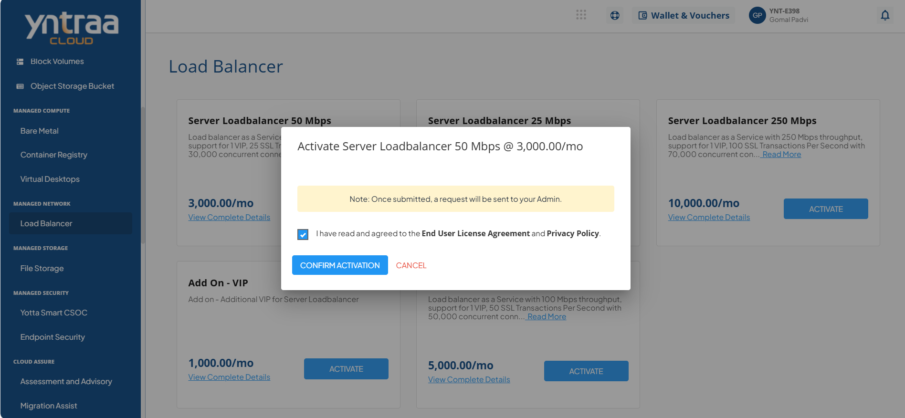

# Load Balancer

Load Balancer is a virtual solution that spreads incoming traffic across multiple servers to maintain high performance, reliability, and smooth user experience. It uses configurable algorithms to distribute requests efficiently, preventing server overload and ensuring better application availability. 

To activate the desired Load Balancer service, perform the following steps:
1. Navigate to **MANAGED NETWORK** > **Load Balancer**
2. Click the **ACTIVATE** button.
3. Select the I have read and agreed to the **End User License Agreement** and **Privacy Policy** option, and click **CONFIRM ACTIVATION** button.
   
   Once submitted, a support ticket will be automatically generated for the operations team for further processing.

For more information about the Load Balancer service, 
