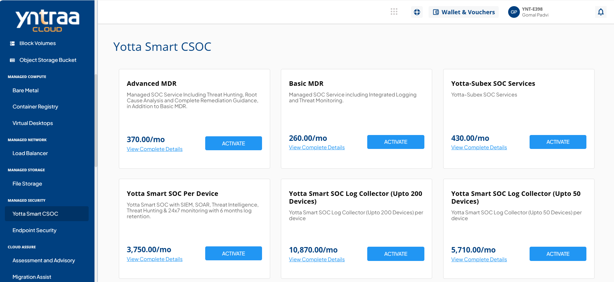

# Yotta Smart CSOC

Yotta Smart Complementary Subservice Organization Controls (CSOC) is a security operations service designed to help organizations effectively manage and respond to growing and complex cyber threats. It combines advanced monitoring and automated response capabilities with expert support to detect, investigate, and remediate security incidents quickly. 

To activate the desired Yotta Smart CSOC service, perform the following steps:
1. Navigate to **MANAGED SECURITY** > **Yotta Smart CSOC**
2. Click the **ACTIVATE** button.
3. Select the I have read and agreed to the **End User License Agreement** and **Privacy Policy** option, and click **CONFIRM ACTIVATION** button.
      
   Once submitted, a support ticket will be automatically generated for the operations team for further processing.
