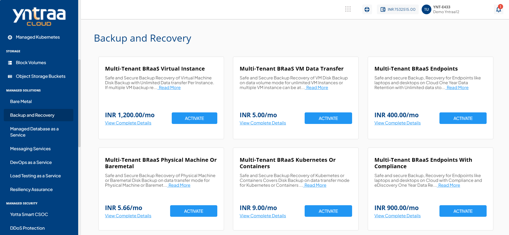
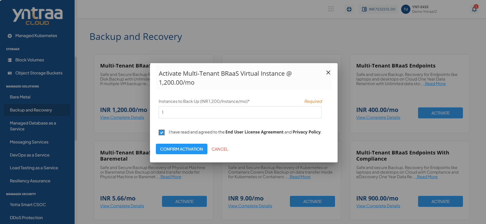

# Backup and Recovery

Multi-tenant Backup, Recovery, and Archival as a Service (BRaaS) is a fully managed solution that protects and restores business data across physical, virtual, and cloud environments. It helps organizations stay prepared for data loss, cyber threats, or system failures by ensuring secure backups and quick recovery.

To activate the desired Multi-Tenant Backup, Recovery, and Archival service, perform the following steps:
1. Navigate to **OTHER SERVICES** > **Multi-Tenant BRaaS**. 
2. Click the **ACTIVATE** button. 
3. Select the I have read and agreed to the **End User License Agreement** and **Privacy Policy** option, and click **CONFIRM ACTIVATION** button.
   
Once submitted, a support ticket will be automatically generated for the operations team for further processing.
   
  For more information about the Multi-Tenant Backup, Recovery, and Archival service, [click here](downloads/BRaaS.pdf).

