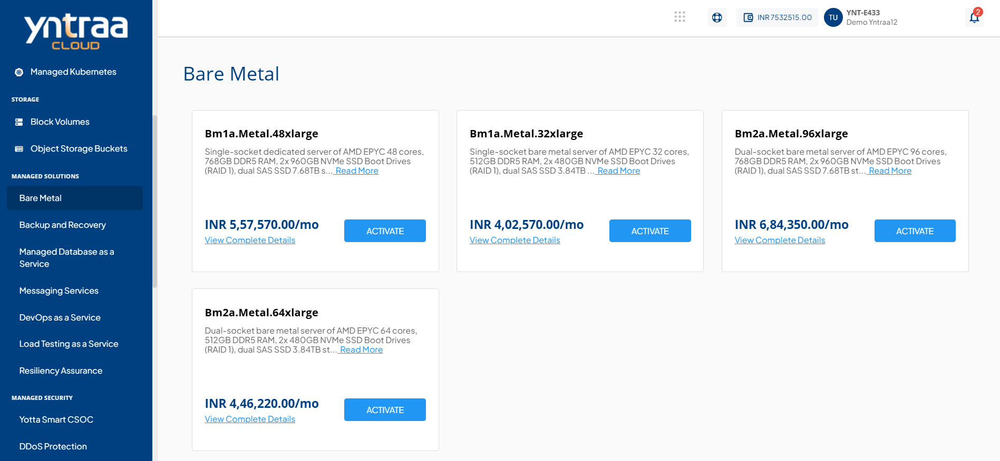
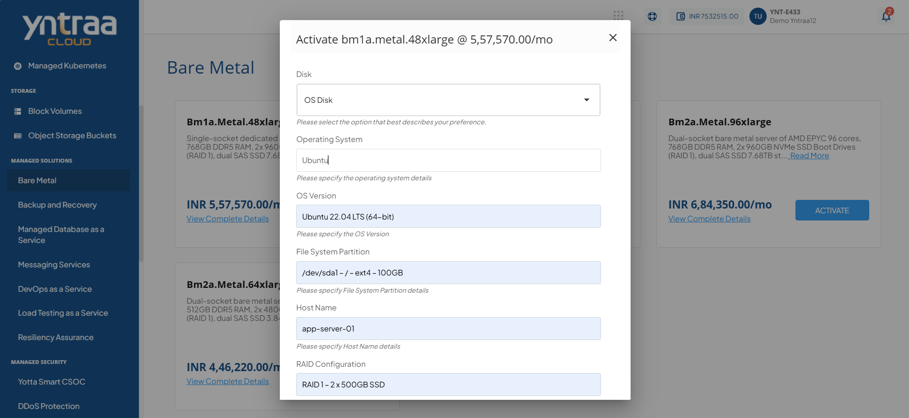
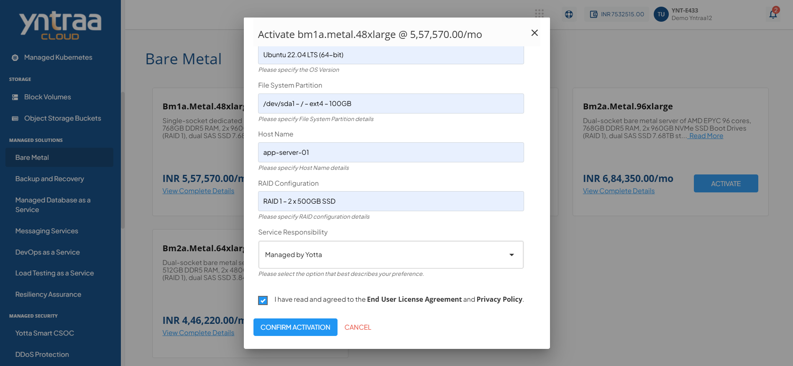

# Bare Metal

Bare Metal Service provides direct access to dedicated physical servers without virtualization overhead, ensuring optimal performance, low latency, and predictable throughput for performance-critical workloads.

To activate the desired Bare Metal service, perform the following steps:
1. Navigate to **MANAGED SOLUTIONS** > **Bare Metal**. 
2. Click the **ACTIVATE** button. 
   
3. Select the I have read and agreed to the **End User License Agreement** and **Privacy Policy** option, and click **CONFIRM ACTIVATION** button.
   
   Once submitted, a support ticket will be automatically generated for the operations team for further processing.

For more information about the Bare Metal service, [click here](downloads/BaremetalService.pdf).
