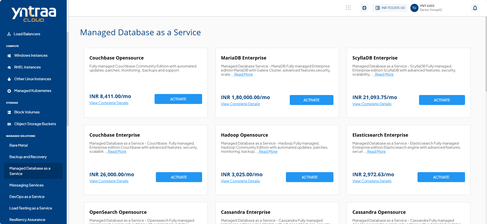
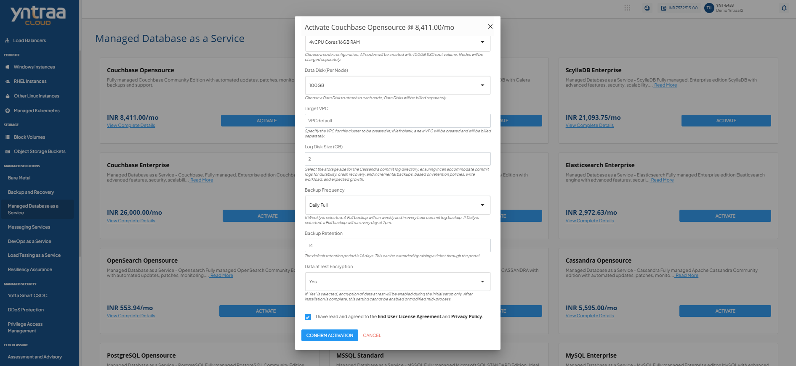

# Managed Database Services

Managed Databases is a cloud-based service that takes care of database setup, maintenance, scaling, and security, so organizations do not have to manage it themselves. It supports both relational and non-relational databases, ensuring high performance, availability, and reliability. 

To activate the desired Managed Database service, perform the following steps:
1. Navigate to **MANAGED SOLUTIONS** > **Managed Databases as a Service**. 
2. Click the **ACTIVATE** button. This action opens the database provisioning request form.
   
Once submitted, a support ticket will be automatically generated for the operations team for further processing.

For more information about the Managed Database service, [click here](downloads/YntraaCloudMDBaaS.pdf).

