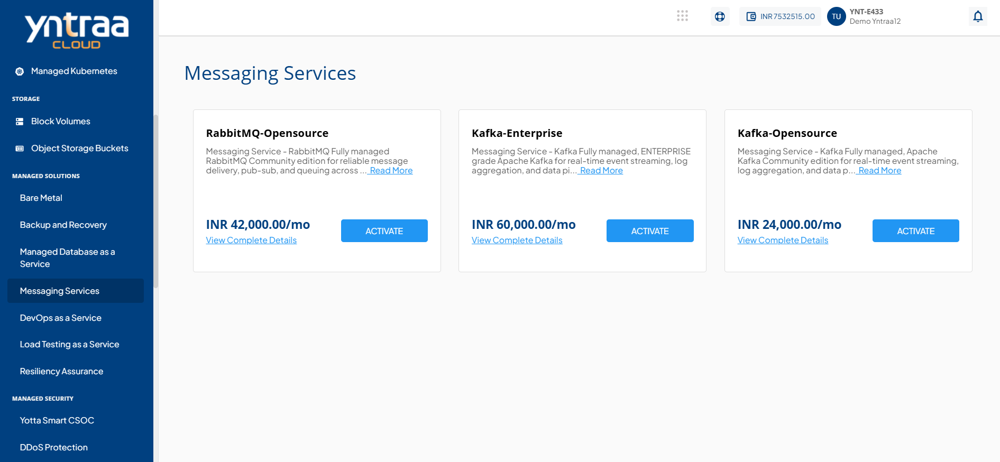
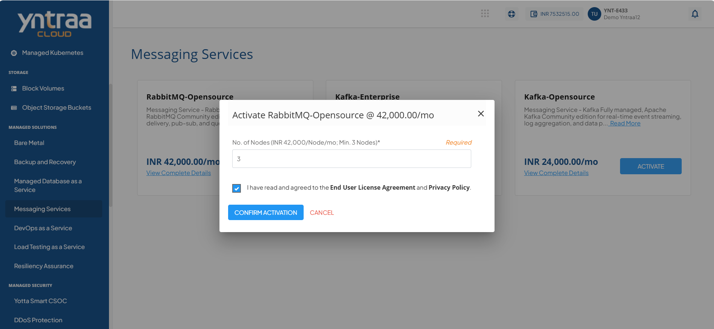

# Messaging Services

In cloud services, Messaging Service enables organisations to build event-driven and real-time applications using managed messaging platforms like RabbitMQ and Kafka. It provides reliable queues and event streams without the complexity of managing infrastructure, ensuring high availability, security, and performance while teams focus on application development.

To activate the desired Messaging Service, perform the following steps:
1. Navigate to **Managed Solutions** > **Messaging Services**. 
2. Click the **Activate** button. 
3. Select the I have read and agreed to the **End User License Agreement** and **Privacy Policy** option, and click **Confirm Activation** button.
   
Once submitted, a support ticket will be automatically generated for the operations team for further processing.

