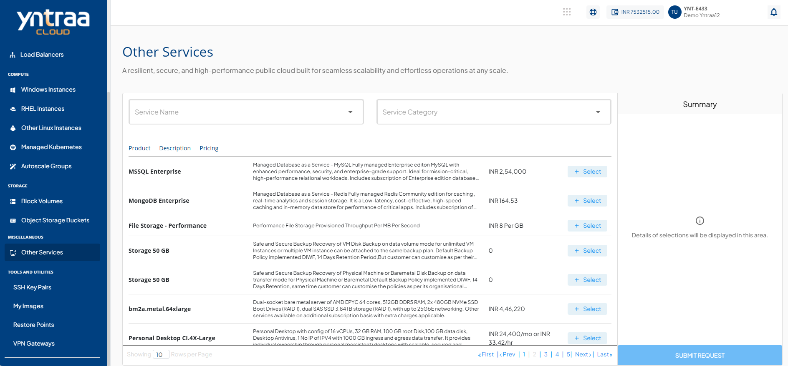
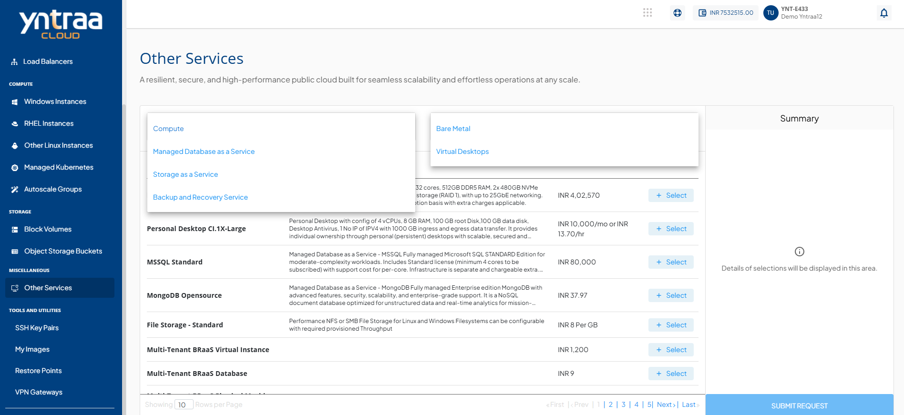
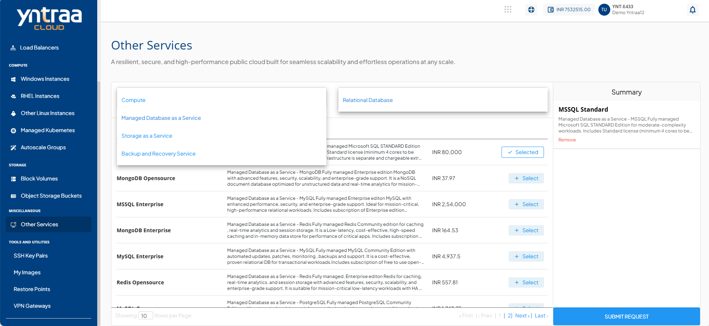
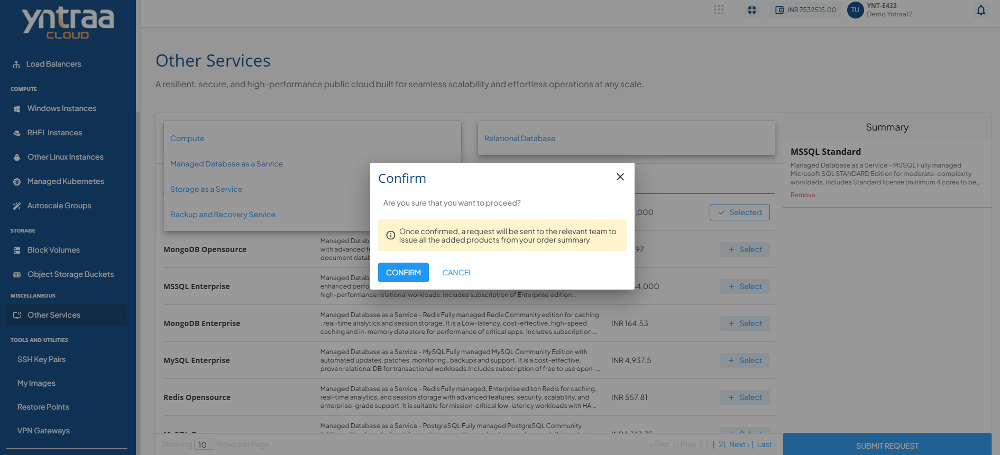

# Other Services

**Other Services** provides access to additional cloud services that support different infrastructure and operational needs. It enables you to explore and manage services efficiently from a single location.

To select and request a service, follow these steps:

1.  Navigate to **Miscellaneous > Other Services**. The following screen appears:
   
2. In the **Service Name** and **Service Category** field, select the required service and category from the drop-down.
   
3. Click **+ Select** button next to the required service and verify the selected service details in the **Summary** section on the right panel.
   
4. Click the **Submit Request** button. The confirmation screen appears, where you can review the service request details and click **Confirm** button to proceed or **Cancel** button to discard the request.
   

   

