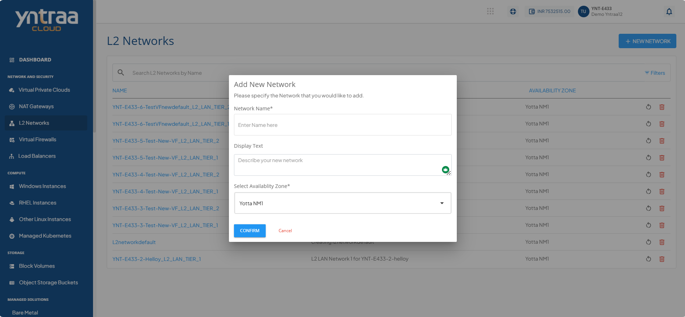

# Adding New L2 Network

To add a new L2 network.

1. Click the **+ New Network** button. The following screen appears:

2. Enter the following details:
	- **Network Name**
	- **Display Text** (Optional)
	- **Select Availability Zone** from the drop-down list.
3. Click the **Confirm** button.
   

