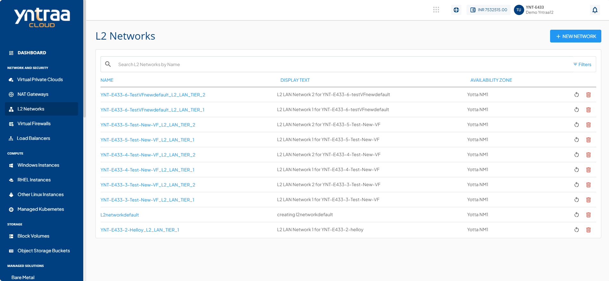
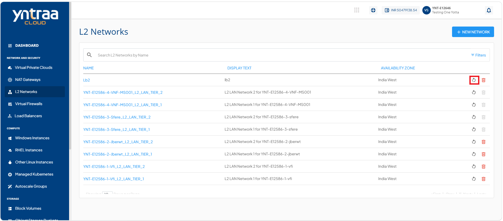
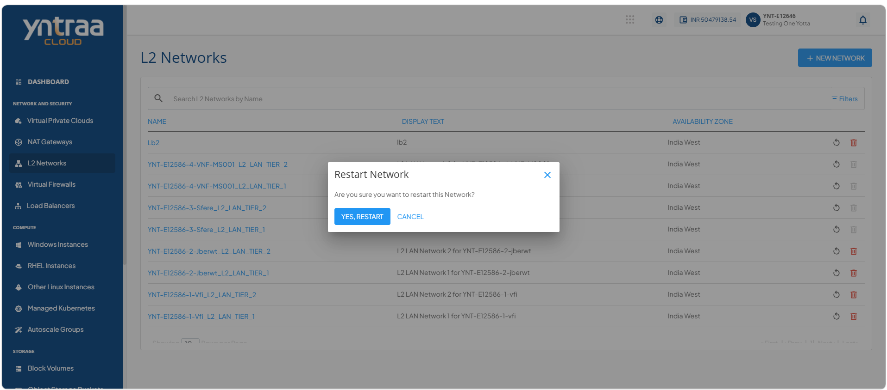
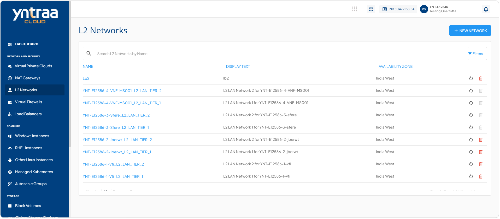
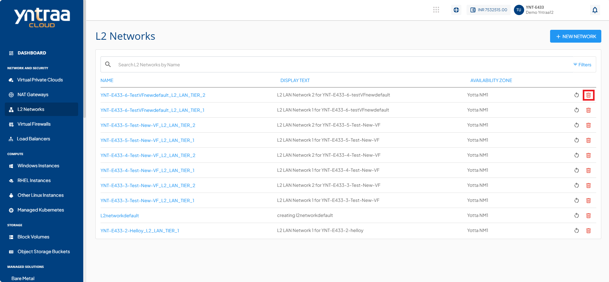
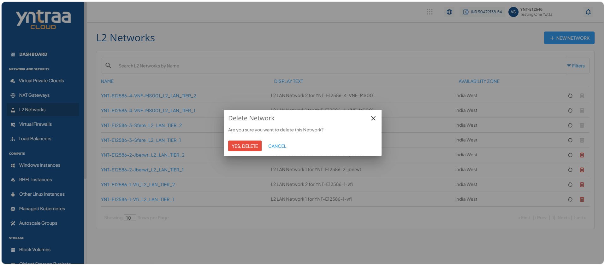
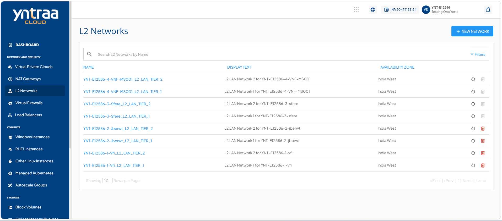

# Managing L2 Networks

L2 network provides Layer 2 connectivity between resources within the same network segment. It enables instances to communicate securely over a private network without routing traffic through external networks. Use L2 networks to organize workloads, simplify network segmentation, and support reliable communication between connected resources.

This section comprises of the following sub-sections:

  
- [Restarting an L2 Network](#restarting-an-l2-network)
- [Deleting an L2 Network](#deleting-an-l2-network)

To manage an L2 network, follow these steps: 

Navigate to **Network and Security > L2 Networks**. The following screen appears: 

## Restarting an L2 Network

Restarting an L2 network refreshes the L2 network to restore its operational state and apply pending changes, if required. Restart an L2 network to resolve temporary connectivity issues and ensure reliable communication between connected resources.

To restart an L2 network, follow these steps: 

1. Navigate to **Network and Security > L2 Networks**. The following screen appears: 

2. Click the **Restart Network** icon (highlighted in red) for the required L2 network. The following screen appears:

3. Click the **Yes, Restart**. The following screen appears:

   
## Deleting an L2 Network

Deleting an L2 network permanently removes an unused Layer 2 network from your environment. Delete an L2 network to free resources, simplify network management, and remove networks that are no longer required.

To delete an L2 network, follow these steps:

1. Navigate to **Network and Security > L2 Networks**. The following screen appears: 
 
2. Click the **Delete Network** icon (highlighted in red) for the required L2 network. The following screen appears:

3. Click the **Yes, Delete** button. The following screen appears:

 

