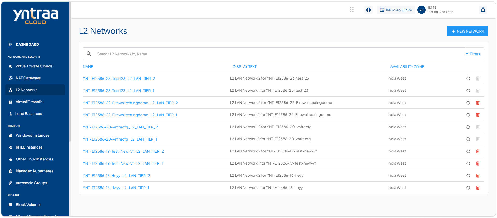

# Viewing L2 Networks

The viewing L2 networks section provides you a centralized view of all Layer 2 (L2) networks within the cloud environment. This page helps you to monitor, identify, and manage configured L2 networks associated with different workloads and availability zones.

To View L2 networks, follow the step:

Navigate to **Network and Security > L2 Networks**. The following screen appears: 

