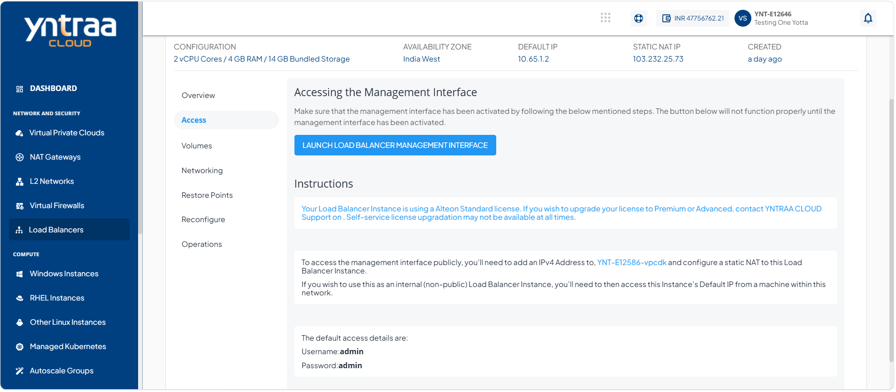

# Activating the Alteon LBI Control Panel

Adding the Alteon is required to enable advanced load balancing, traffic management, and security features for your application environment. 

To activate the Alteon LBI control panel and accessing it after activation, follow these steps:

1. Navigate to **Network and Security > Load Balancers**. The following screen appears:
   
2. Click the instance name from the list. The following screen appears:
   
3. Click **Access**. The following screen appears: 
  
4. Click the **Launch Load Balancer Management Interface** button.
5. Click the **Launch Console** button to access the Instance's console interface. One-by-one, run the following commands:

```
set ns config -IPAddress <VM_private_IP_address> -netmask <VM_tier_netmask>
add route 0 0 <gateway_IP_address_for_tier>
save config
reboot
```

:::note
You can find all the required details in the parent VPC and/or on the LBI details sections of Yntraa Cloud.
:::


