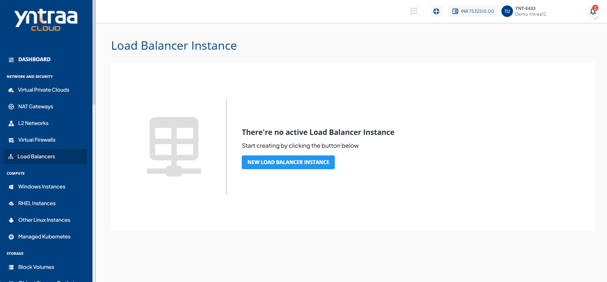
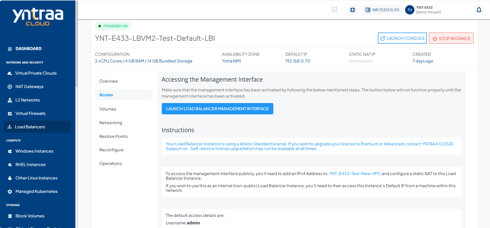

# Activating the NetScaler VPX Control Panel

Adding the NetScaler VPX is required to enable advanced load balancing, traffic management, and security features for your application environment. 

The following steps can be used for activating the NetScaler VPX control panel and accessing it after activation:

1. Navigate to **Network and Security > Load Balancers** and click the LBI whose control panel needs to be activated.
   
   
2. In the LBI details, click the **Launch Console** button to access the Instance's console interface. One-by-one, use the following commands:

```
set ns config -IPAddress <VM_private_IP_address> -netmask <VM_tier_netmask>
add route 0 0 <gateway_IP_address_for_tier>
save config
reboot
```


:::note
All the required details can be found in the parent VPC and/or on the LBI details sections of Yntraa Cloud.
:::

After completing the above steps, click the **Launch Load Balancer Management Interface** button in the **Access** section of the LBI details to access the NetScaler VPX UI.




