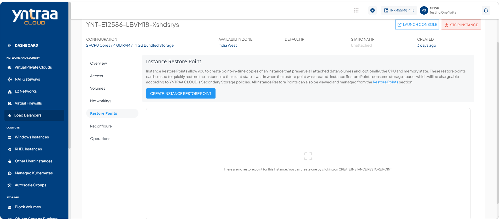
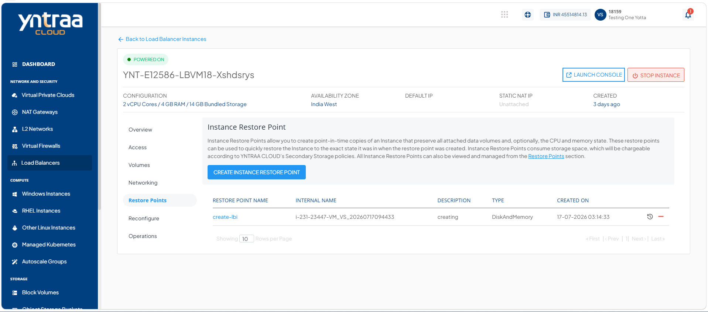
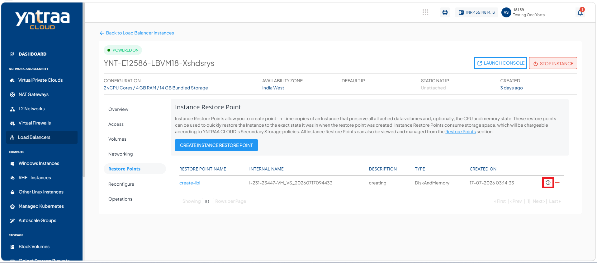
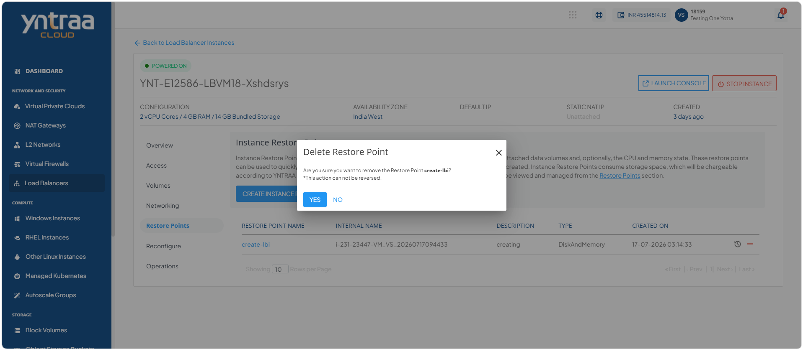

# Creating Instance Restore Point

An instance restore point is a recovery restore point that captures the current state of a instance, enabling you to restore it to that specific point if required. Creating a restore point helps protect your data and system configuration before making changes such as software updates, configuration modifications, or maintenance tasks. It provides a reliable way to recover the instance quickly in case of unexpected issues, minimizing downtime and reducing the risk of data loss.

This section comprises of the following sub-sections:

  
- [Restoring an Instance Restore Point](#restoring-an-instance-restore-point)
- [Deleting an Instance Restore Point](#deleting-an-instance-restore-point)

To create an instance restore point, follow these steps:

1. Navigate to **Network and Security > Load Balancers**. The following screen appears:

 2. Click on your created **Instance** from the list. The following screen appears:

3. Click **Restore Points**. The following screen appears: 

4. Click the **Create Instance Restore Point** button. The following screen appears:

5. Click the **Create** button. The following screen appears: 

## Restoring an Instance Restore Point

Restoring an instance from a restore point reverts the load balancer instance to a previously saved state. This operation restores the instance configuration and data captured at the selected restore point, allowing you to recover from configuration errors, failed updates, or other unexpected issues. Restoring a restore point helps minimize service disruption, ensures business continuity, and provides a reliable method to recover the load balancer instance to a known working state.

To restore an instance restore point, follow these steps: 

1. Navigate to **Network and Security > Load Balancers**. The following screen appears:

 2. Click on your created **Instance** from the list. The following screen appears:

3. Click **Restore Points**. The following screen appears: 

4. Click the **Restore from Instance Restore Point** icon (highlighted in red). The following screen appears: 

5. Click the **Yes** button. 

## Deleting an Instance Restore Point

Deleting a restore point permanently removes a saved recovery point from the load balancer instance. You can delete restore points that are no longer required to free up storage and keep your restore point list organized. Before deleting a restore point, ensure that it is no longer needed for future recovery, as the action is irreversible and the restore point cannot be recovered once deleted.

:::warning
This action can not be reversed.
:::

To delete an instance restore point, follow these steps: 

1. Navigate to **Network and Security > Load Balancers**. The following screen appears:

 2. Click on your created **Instance** from the list. The following screen appears:

3. Click **Restore Points**. The following screen appears: 

4. Click the **Delete Restore Point**. The following screen appears: 

5. Click the **Yes** button. The restore point is deleted.
   
