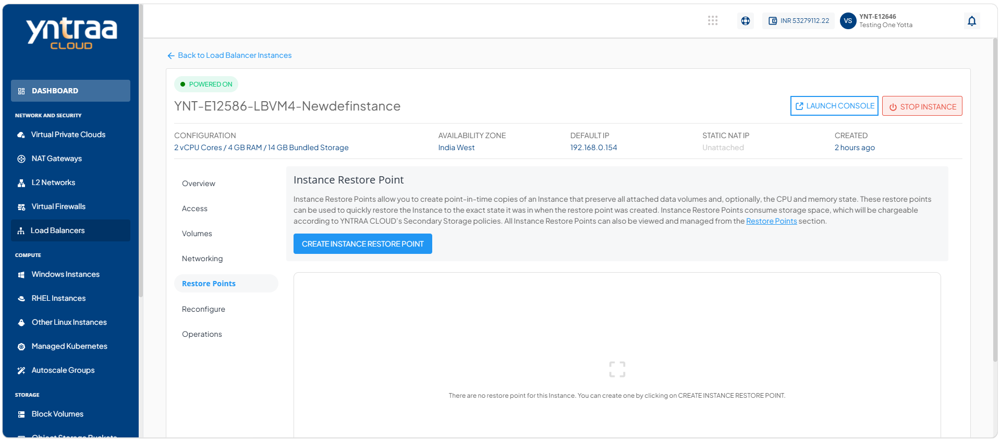
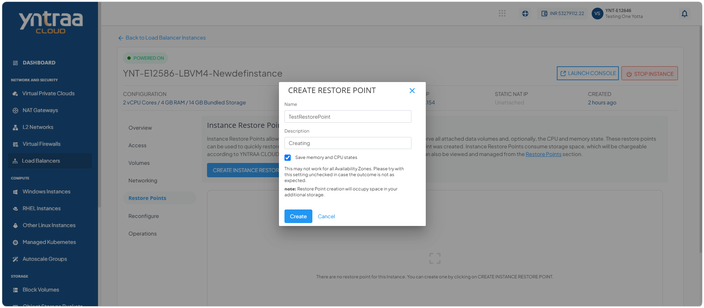
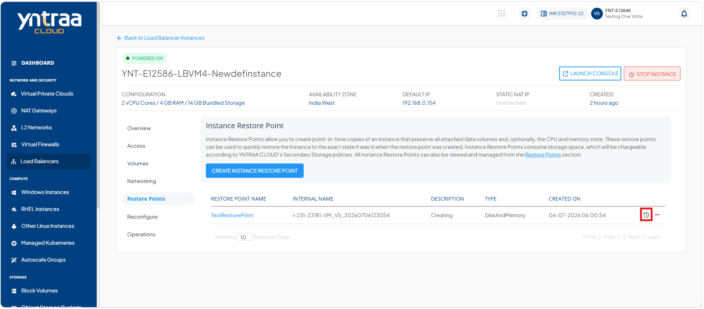
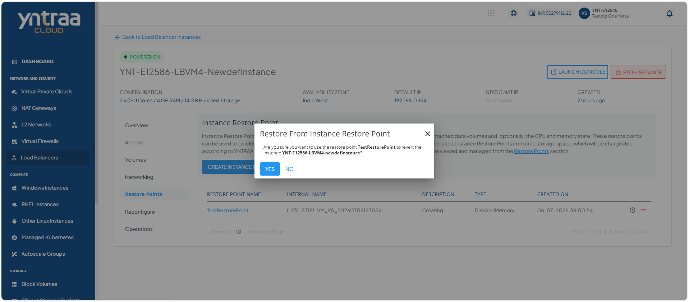

# CreatingInstanceRestorePoint

To create the instance restore point, follow these steps:

1. Navigate to **Network and Security > Load Balancers**. The following screen appears:

 2. Select a **Load balancer Instance** and click the **Restore points** tab. The following screen appears:

3. Click the **Create Instance Restore Point** button. The following screen appears where you provide the required details:

- Name
- Description
- Select the option save memory and CPU states

4. Click the **Create** button. The following screen appears: 

5. Click the **Restore from instance restore point**. The following screen appears: 

6. Click the **Yes** button. The following screen appears: 
   
   
7. Select a **Compute Pack** from the list, and click the **Reconfigure Compute Pack** button. The following screen appears: 
 
8. Select the option **I have read and agreed to the Yntraa Cloud Terms and Conditions and Privacy Policy**.
9. Click the **Confirm reconfigure** button. The following screen appears:
 

   
