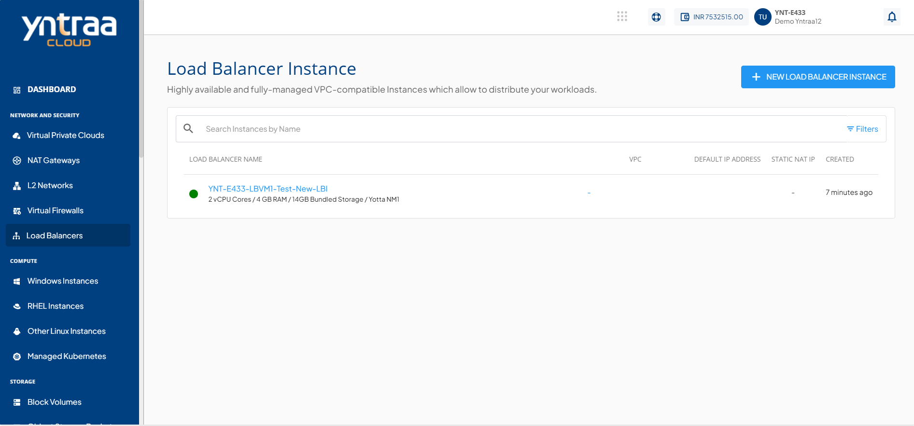
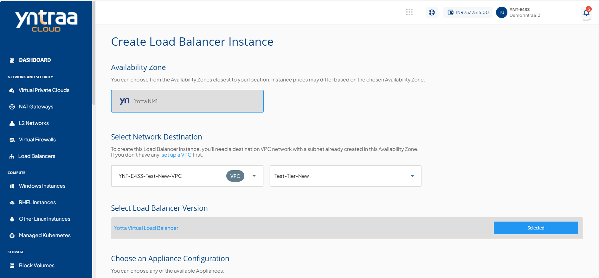
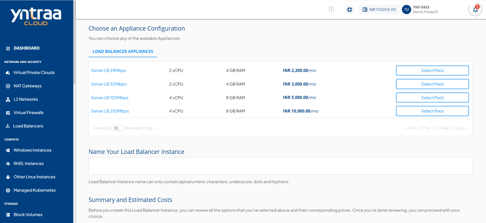
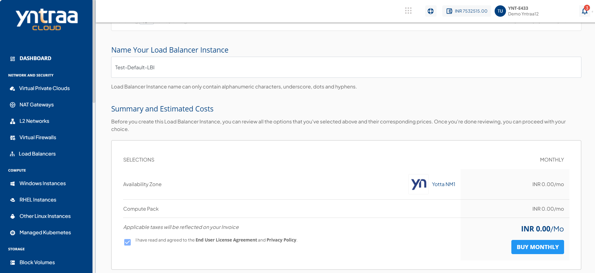

# Creating a Load Balancer Instance

Load Balancer Instances can be created inside a VPC by following these simple steps:

1. Navigate to **NETWORK AND SECURITY> Virtual Private Clouds** and select a VPC in where LBI needs to be placed. If unavailable, [create a new VPC](/docs/Subscribers/NetworkandSecurity/VirtualPrivateClouds/AboutVPCInstances/CreateListandViewVPCs).
2. In the VPC, [create a subnet tier](/docs/Subscribers/NetworkandSecurity/VirtualPrivateClouds/AboutVPCInstances/CreatingVPCSubnetsTiers) with any desired configuration(s).
3. Add an additional [IPv4 Address](/docs/Subscribers/NetworkandSecurity/VirtualPrivateClouds/AboutVPCInstances/IPv4AddressesandVPC) to the VPC and keep it 'unused'.
4. Navigate to **NETWORK AND SECURITY > Load Balancers** and click the **+ NEW LOAD BALANCER INSTANCE** button to access the LBI creation options.
   
5. Choose an **Availability Zone**, which is the geographical region where your Instance will be deployed.
6. In the **Select VPC and Tier** section, specify the VPC and subnet as created in steps 1 and 2 above. 
7. Select a Load Balancer Version.
   
8. Choose appliance configuration from the list.
   
9. Choose the Standard Root Disks from the options and provide a name to your instance. The Instance name must only contain alphanumeric characters, underscore, dots and hyphens.
10. Under the **Summary and Estimated Costs** section, verify the estimated cost of your Instance based on the chosen specifications.
11. Select the I have read and agreed to the **End User License Agreement** and **Privacy Policy** option.
12. Click the **BUY MONTHLY** button. The Confirm Instance Purchase window appears, and the price summary is displayed along with the discount codes if you have any in your account. 
    - You can apply any of the discount codes listed by clicking on the **APPLY** button. 
    - You can also remove the applied discount code by clicking the **REMOVE** button. 
    - You can cancel this action by clicking on the **CANCEL** button.
   
13. Once the LBI is created, navigate back to the VPC and configure the added **IPv4 Address** as a Static NAT on the newly-created Load Balancer Instance.

:::note
The above steps create an LBI and place it in the correct spot in the network. To configure traffic management rules and access other options via the NetScaler VPX control panel, additional activation steps are needed. These instructions are sent over email when an LBI is created.
:::

