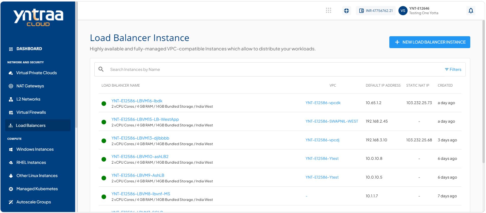
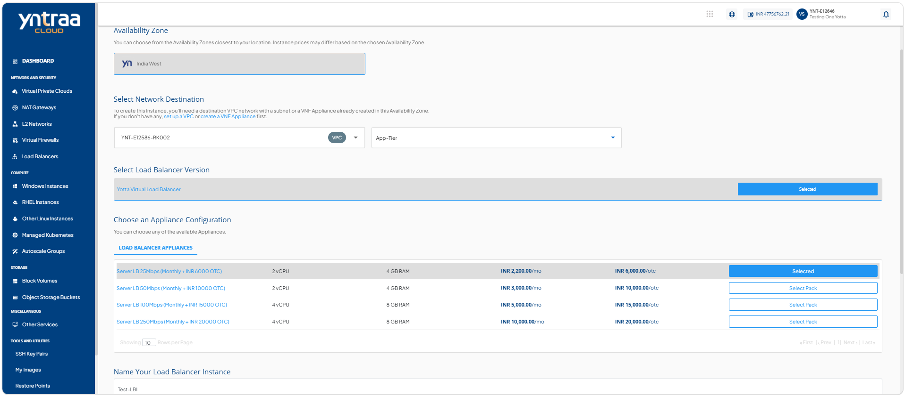
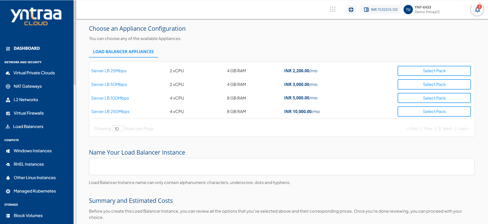
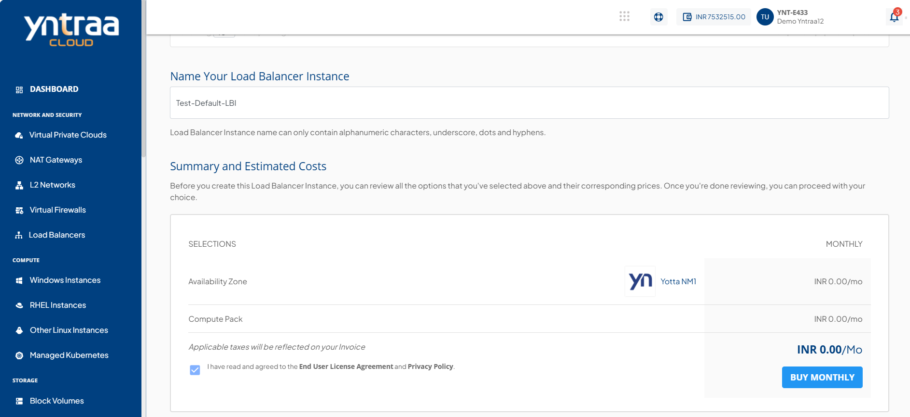

# Creating a Load Balancer Instance

Creating a Load Balancer Instance provisions a dedicated load balancing appliance within your virtual network to distribute application traffic across multiple backend resources. Create a Load Balancer Instance to improve application availability, optimize traffic distribution, and enhance performance by directing client requests to healthy backend servers.

To a create a load balancer instances, follow these steps:

1. Navigate to **Network and Security> Load Balancers**. The following screen appears: 
 
 2. Click the **+ New Load Balancer Instance** button. The following screen appears:

3. Choose an **Availability Zone**, which is the geographical region where your Instance will be deployed.
4. In the **Select Network Destination**, specify the VPC and subnet.
5. Select **Load Balancer Version**.
6. Under the **Choose an Appliance Configuration**, select a Load Balancer Appliance pack.
   
7. **Name Your Load Balancer Instance**.
8. Under the **Summary and Estimated Costs** section, verify the estimated cost of your Instance based on the chosen specifications.

9. Select the **I have read and agreed to the End User License Agreement and Privacy Policy** option.
10. Click the **Buy Monthly** button. The Confirm Instance Purchase window appears, and the price summary is displayed along with the discount codes if you have any in your account. 
    - You can apply any of the discount codes listed by clicking on the **Apply** button. 
    - You can also remove the applied discount code by clicking the **Remove** button. 
11. Once the LBI is created, navigate back to the VPC and configure the added **IPv4 Address** as a Static NAT on the newly-created Load Balancer Instance.

:::note
The above steps create an LBI and place it in the correct spot in the network. To configure traffic management rules and access other options via the NetScaler VPX control panel, additional activation steps are needed. These instructions are sent over email when an LBI is created.
:::

